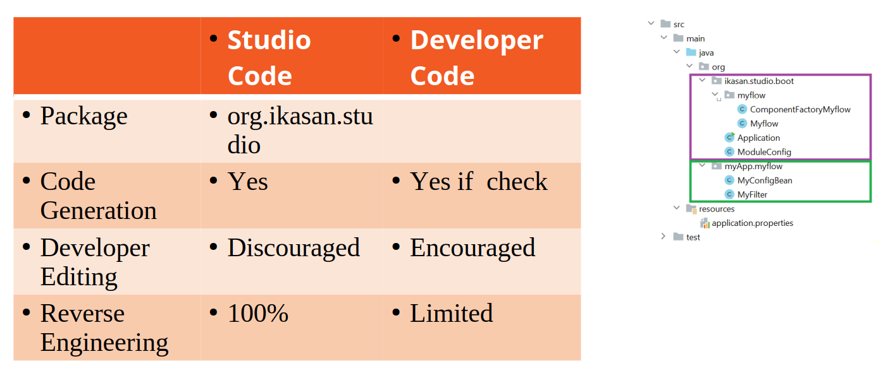

# Ikasan Studio

Ikasan Studio is a visual designer and integrated development environment for the Ikasan Enterprise Integration Platform (EIP).

When combined as a plugin to Intellij, it provides a fully functional, standalone IDE for designing and maintaining Ikasan modules.

## Start here

The current release candidate requires IntelliJ IDEA 2024.2 or newer (build 242) and bundles Ikasan V3.3.9 and V4.1.6. See [Supported versions](docs/SupportedVersions.md) for tested IDE builds and the separate project JDK requirements.

Install the candidate ZIP through **Settings → Plugins → gear → Install Plugin from Disk**. Plugin developers can build it with `./gradlew buildPlugin`; the ZIP appears under `build/distributions/`. Follow the release's own download instructions when installing a published candidate.

Start with [Your first module in five minutes](docs/GettingStarted.md): create a Maven archetype project, add a Scheduled Consumer and Logging Producer, run the module, then inspect its Blue Console.

| Guide | What it covers |
| --- | --- |
| [Supported versions](docs/SupportedVersions.md) | IntelliJ, Ikasan packs and project JDKs |
| [Harnesses](docs/Harnesses.md) | Email, FTP, JMS readers, injection and real scans |
| [Project files and recovery](docs/ProjectFilesAndRecovery.md) | Generated/user ownership, model backups and restoration |
| [Troubleshooting](docs/Troubleshooting.md) | Ports, Maven, indexing, startup and debugging |
| [Type guidance](docs/TypeGuidance.md) | Type warnings and converter suggestions |
| [Privacy and network behaviour](docs/DiagnosticsAndPrivacy.md) | Local data, downloads, connections and reporting |
| [Known limitations](docs/KnownLimitations.md) | Current boundaries and release checks |
| [Version migration](docs/IkasanVersionMigration.md) | Preview, apply and restore between supported packs |
| [Flow copy/paste](docs/FlowCopyPaste.md) | Reuse flows across projects |

Studio opens in IntelliJ's main editor area. Reopen it with the squid icon on the far-right stripe, **Tools → Open Ikasan Studio**, or Find Action. The **Console** control opens the module-local Blue Console, distinct from the central Ikasan Dashboard.

The following architecture and roadmap sections contain historical design context. Use the guides above for current user workflows and supported behaviour.

## High level design / motivations

* Scaling
  * Reduced learning time for new resources.
  * Reduced complexity for new resources.
  * Reduced time to production since most of the code is already written.
  * Simple modules can be generated directly by the business owner.
* Quality -
  * The majority of module is code via configuration, with the underlying code / generated based on best practice implementations from the Ikasan core team.
  * The graphical representation of the module quickly exposes flaws in the business process path.
  * Opportunities for localised developer testing and debugging.
  * Configuration is subjected to validation checks reducing semantic errors.
  * Core (generated) code is subjected to enhanced automated testing.
  * Developers are focused on the exception processing, with more time to extend testing for the bespoke data transformations.
  * Core developers are focused on enhancements to the core code
  * Opportunities for daily improvement via CI against the core libraries.
  * Localised payload transformation analysis assists with production issue replication and resolution.
* Migration
  * The json model creates a layer of abstraction between the business 'application' and the underlying version of Ikasan, once standard meta-packs have been written, upgrading or downgrading versions of Ikasan can be a simple as a drop-down chooser.
* Transparency
  * The business and IT can collaborate quickly on the model generation.
  * The model diagram forms part of the delivery, by definition will always be upto date.
* Cost of ownership
  * Corporate coding standards and implementation standards enforced by the auto-generated code.
  * Consistency in implementation reduces support costs.
  * Reduction in project written code results in reduction of development time and all related QA activities
  * Upgrades between versions of Ikasan greatly simplified via json (not Java) as the source code model, reducing legacy friction and therefore legacy support costs.
  * Improvements and bug fixes to core Ikasan features can be applied with reduced / no alteration to the module configuration / bespoke code.
  * Localised developer testing and debugging reduces the reliance on expensive centralised server resource
* Flexibility
  * Custom components or implementations can be generated by development teams, with either minor extensions or complete bespoke library of components.
  * Custom components have a lifecycle route back to the core libraries

## Version Neutral Data Model

The Module, Flows and Components are persisted using the Ikasan JSON data model, which is version neutral. This allows the Studio to be used with multiple versions of Ikasan, and for the model to be migrated between versions of Ikasan.
see https://github.com/ikasanEIP/ikasan/blob/4.0.x/ikasaneip/topology/README.md for further details.

## Application Split

Offering is split into 3 artefacts with independent lifecycles



### Core (org.ikasan.studio.core)

* Contains the model.json (de)serialisation
* Framework for code generation (ftl supplied by meta pack),
* Framework for unit test support for meta pack, abstract support for meta pack

### Metapack (resources/studio/metapack) - depends on Core

* One per supported Ikasan version
* Reduces the number of updates to the core (UI) plugin, the metapack can be added to (almost) any version of the plugin
* Distribution / exposed via web / repo / something
* Component Library - Encapsulates the Components properties, meta-information, helptext, icons and ftl for a version of Ikasan, or an 'approach to auto-generation implementation', or user created components / code practice.
* Provides extensive unit testing to self certify
* End user encouraged to create their own, only official metapacks are 'supported'

### UI (org.ikasan.studio.ui) - Depends on Core and Metapacks

* Business driver is cost saving resulting from standard coding of components, reduced build times, reduced migration between versions of Ikasan, reduced complexity in legacy code base
* The UI should be easy to use, intuitive, dumb down usage for junior / mid-tier devs
* Abstracted to be driven from the content of a meta pack
* Support for multiple simultaneous metapacks
* Resilient and defensive, the UI needs to accommodate developer errors (misconfigured flows or metapacks) without resulting in serious errors in the IDE (Intellij are very keen to expose even slightly wonky plugins). Where possible, the IDE should recover misconfiguration and inform the user via popup / message balloons.

## Epics / major stories

Core

* Extract the 'core' part into standard maven1 project, build into jar and expose in repo accessible by project (CAUTION - resource restrictions in official Ikasan Github).
* Create builder / Maven integration for non-UI code regeneration, integrate into maven.
* Expand out model.json to accommodate 'code hooks' and any non-standard attributes e.g. meta-pack version (organic, maybe driven by needs of UI).
* Parametrise meta pack version in build.
* Explore DB driven configuration.
* Explore how to integrate with environment configurations solutions.

Meta pack(s)

* Ikasan SME to identify the set of core Ikasan components to be supported in MVP1.
* Ikasan SME to identify review and correct all auto generated classes code properties files (ftl templates).
* Ikasan SME to identify review and correct all properties for completed components, identify as standard / advanced.
* Ikasan SME to work on ftl templates for remaining core Ikasan components.
* Split out metapack with its unit tests into separate module with dependent on code.
* Add in aggregate components with associated free marker templates.
* Add metapacks for Ikasan V4.x.
* Add metapacks for Bespoke implementations / libraries / user overrides.
* Add Junit stubs for all user generated classes.
* Support generic bespoke classes e.g. brokers, consumer, splitters etc

UI

* Split component configuration into standard with drop down advance tab.
* Rework the way mandatory components are highlighted to remove issue with 'user code regeneration' affecting components.
* Support generic bespoke classes e.g. brokers, consumer, splitters, etc.
* Expand component configuration to support beyond basic Wrapped Java types e.g. lists.
* Move component configurations to palette for shared to tabbed usage.
* Code to support user implemented and user supplied classes - integration into model.json, including 'shared' poms and properties - maybe explore multiple project roots.
* Validate current methods to run application from UI, ensure H2 config not dangerous
* Add support for wiretaps
* Review / improve handling of component deletion, auto generated and user generated.
* Single step debug mode for flows, using maybe wiretap.
* Support archetype to build the project, maybe partially implemented projects.
* Sort out icons with correct scaling and transparency to support standard IntelliJ themes.
* Update UI look and feel for all modes of Intellij themes.
* Parametrise meta pack version in model startup.
* Data exchange / XML mapping of payload for simple transitions / mappers.
* Explore DB driven configuration.
* Robustness tests.
* Eclipse, Vaaden, Javascript based IDE.

CI

* Determine how / what output from the build process are integrated into standard M processing.
* Integration with marketplace and Maven central / licence.

Other

* Videos
* Help wiki
* Demos
* Jira ?
* Public Forum for self-help (stack overflow sub-site)

## Manual archetype fallback

In the Maven Archetype wizard, search for `org.ikasan.studio:ikasan-studio-project-archetype`. Choose the version supplied for your release. The source tree currently declares version `1.0.3`; this is not a statement that this version has been published to Maven Central.

Plugin contributors can install the checked-out archetype and its parent locally, from the repository root:

```sh
mvn -f ikasan-studio-ancillary/pom.xml -N install
mvn -f ikasan-studio-ancillary/ikasan-studio-project-archetype/pom.xml install
```

Then, from a separate directory where you want to create the example:

```sh
mvn archetype:generate -DarchetypeGroupId=org.ikasan.studio -DarchetypeArtifactId=ikasan-studio-project-archetype -DarchetypeVersion=1.0.3 -DgroupId=org.example -DartifactId=my-module -DinteractiveMode=false
```

On Windows shells that split Maven property arguments, quote each complete `-Dname=value` argument. Open the generated project's root `pom.xml` in IntelliJ and allow Maven import/indexing to finish. Continue with [module configuration](docs/GettingStarted.md#2-configure-the-module). See [Troubleshooting](docs/Troubleshooting.md) for repository access or SDK failures.

## Reporting problems

For an unexpected Ikasan Studio plugin error, IntelliJ's error dialog offers a report action that sends the reviewed report through JetBrains Marketplace to the Studio development team. Review the details, attachments and privacy notice before submitting. Studio does not attach model files.

For other support investigations, **Tools → Collect Ikasan Studio Diagnostics…** creates a local ZIP; it does not upload it. See [Diagnostics and privacy](docs/DiagnosticsAndPrivacy.md) for report contents, privacy differences and release verification.

## Plugin Development Guidelines

These guidelines are for developers working on the plugin itself.

The main plugin uses the Java 17 toolchain. Building the optional native MCP module also requires
a Java 21 toolchain for its newer IntelliJ SDK; its output still targets JVM 17. End users need
no additional runtime for AI setup: the adapter uses the running IDE runtime.

### Use an AI with the live Studio design

Select **Tools → Connect AI to Ikasan Studio…** for guided IntelliJ MCP setup or a reusable manual configuration for your AI client
(the adapter uses IntelliJ's Java runtime; no separate runtime installation is needed). The AI can
read the live design and component catalogue, then submit a validated proposal. Review and **Apply** it in Studio as one undoable model change. See the
[Studio AI bridge guide](docs/StudioAiBridge.md) for setup, supported operations and examples.

### Choose a sandbox IDE

Select **Run Plugin** in IntelliJ's Run/Debug menu to launch Studio in IntelliJ IDEA 2026.2.2.
For regression testing, select **Run Plugin (2024.3.7 Regression)** to launch IntelliJ IDEA Community 2024.3.7.
Reload the Gradle project after changing the build configuration.

The equivalent terminal commands are:

```shell
./gradlew runIdeModern  # IntelliJ IDEA 2026.2.2
./gradlew runIde        # IntelliJ IDEA Community 2024.3.7
```

These sandboxes keep separate settings and installed plugins. The first launch may download the IDE and its runtime.
In the newer sandbox, install/update **JetBrains AI Assistant**, select **Codex** in AI Chat, and sign in with ChatGPT.
See [JetBrains' agent activation instructions](https://www.jetbrains.com/help/ai-assistant/activate-agents.html).
The newer IDE uses the unified IntelliJ IDEA distribution; its free features do not require an Ultimate subscription.

`sandboxIdeVersion` in `gradle.properties` controls only the newer sandbox. You can override it for one run with
`./gradlew runIdeModern -PsandboxIdeVersion=2026.2.2`. Compilation and automated tests continue to target
Community 2024.3.7 through `platformType` and `platformVersion`; do not change those just to switch sandboxes.

The 2026.2.2 sandbox uses IntelliJ's fallback file chooser to avoid an upstream EDT slow-operation error
when selecting a JDK in **Project Structure → SDKs** (`UniversalFileChooser.toVirtualFiles`).
This is scoped to `runIdeModern` with `sandboxIdeVersion=2026.2.2`, using
`-Duniversal.file.chooser.is.enabled=false`; slow-operation checks remain enabled.
Restart the sandbox through **Run Plugin** after reloading Gradle to apply it.
For an already running IDE, open **Find Action → Registry…**, turn off
`universal.file.chooser.is.enabled`, then reopen the SDK chooser.
JetBrains documents this [file chooser fallback](https://platform.jetbrains.com/t/file-chooser-ui-is-different-in-intellij-versions-2026-1-and-2026-2-when-running-tests-with-the-native-file-chooser-disabled/4827).
The separate `preferences.language.Kotlin.scripting` deprecated-group warning comes from the bundled Kotlin plugin.


### Do not let any exceptions bubble up to Intellij

These get reported directly to the user with the recommendation to disable the plugin and report it to Idea.
Where possible, log it with a stack trace and try to recover or abort that particular operation.

### Do not use @NotNull

These bubble up to the IDE with the recommendation to disable the plugin and report it to Idea.

### Do not use anything greater than warn when using Intellij's logger

Anything greater than warn results in a stack trace reported directly to the user with the recommendation to disable the plugin and report it to Idea.

### Defensive coding is essential

You don't have to make many mistakes to get blacklisted.

### Current Branching Strategy

* **main** is used for the current development stream and producing SNAPSHOT builds.
* **1_0_x** is used for formal builds / deployment to Maven Central.


## Template ToDo list

- [X]  Create a new [IntelliJ Platform Plugin Template][template] project.
- [ ]  Get familiar with the [template documentation][template].
- [ ]  Adjust the [pluginGroup](./gradle.properties) and [pluginName](./gradle.properties), as well as the [id](./src/main/resources/META-INF/plugin.xml) and [sources package](./src/main/java).
- [ ]  Adjust the plugin description in `README` (see [Tips][docs:plugin-description])
- [ ]  Review the [Legal Agreements](https://plugins.jetbrains.com/docs/marketplace/legal-agreements.html?from=IJPluginTemplate).
- [ ]  [Publish a plugin manually](https://plugins.jetbrains.com/docs/intellij/publishing-plugin.html?from=IJPluginTemplate) for the first time.
- [ ] Add the verified Marketplace listing link after publication.
- [ ]  Set the [Plugin Signing](https://plugins.jetbrains.com/docs/intellij/plugin-signing.html?from=IJPluginTemplate) related [secrets](https://github.com/JetBrains/intellij-platform-plugin-template#environment-variables).
- [ ]  Set the [Deployment Token](https://plugins.jetbrains.com/docs/marketplace/plugin-upload.html?from=IJPluginTemplate).
- [ ]  Click the <kbd>Watch</kbd> button on the top of the [IntelliJ Platform Plugin Template][template] to be notified about releases containing new features and fixes.

<!-- Plugin description -->

This plugin provides a visual designer and integrated development environment for the Ikasan Enterprise Integration Platform

* https://github.com/ikasanEIP
* https://www.youtube.com/@Ikasan-nq3js

<!-- Plugin description end -->

Studio supports reviewed migration between Ikasan V3.3.9 and V4.1.6. Use **Migrate…** on
the canvas or **Tools → Migrate Ikasan Version…**. See [version migration](docs/IkasanVersionMigration.md)
for previews, compatibility checks and recovery snapshots.

Select an FTP producer or consumer to see dashed arrows to components sharing its configured host,
port, security mode and directory. **Show shared endpoints** displays all these connections in the module.
Hover over an arrow to see the endpoint. These indicate possible file hand-offs; filename filters,
account home directories and runtime configuration can affect delivery. Unresolved property expressions
and custom source-directory factories are not matched.


Ikasan EIP is a mature and well maintained integration platform based on industrial patterns (https://www.enterpriseintegrationpatterns.com/) to satisfy complex, disparate and demanding integration requirements of the finance sector.

## Installation

Use the ZIP installation instructions under [Start here](#start-here). Marketplace installation instructions and a direct listing link will be added when the listing is published and verified.

---

Plugin based on the [IntelliJ Platform Plugin Template][template].

[template]: https://github.com/JetBrains/intellij-platform-plugin-template
[docs:plugin-description]: https://plugins.jetbrains.com/docs/intellij/plugin-user-experience.html#plugin-description-and-presentation

### Converter recipes

Generic converters offer persistent recipe selection, downstream type suggestions, and reusable content extraction and payload construction for FTP/SFTP, email and JMS. See [Converter recipes](docs/ConversionRecipes.md) for supported inputs, configuration, code ownership and verification.

## Testing strategy

See [Engine and meta-pack testing](docs/TestingEngineAndMetaPacks.md) for test ownership, engine and pack suite commands, focused tests, reports, and broader verification.

For Java objects sent through ActiveMQ, see [JMS Object Messages](docs/JmsObjectMessages.md)
for the **Trusted object packages (ActiveMQ)** setting and a two-flow example.
