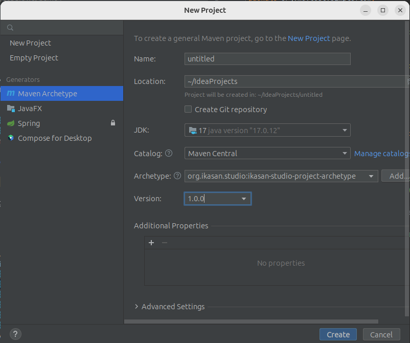
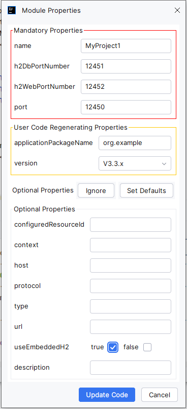
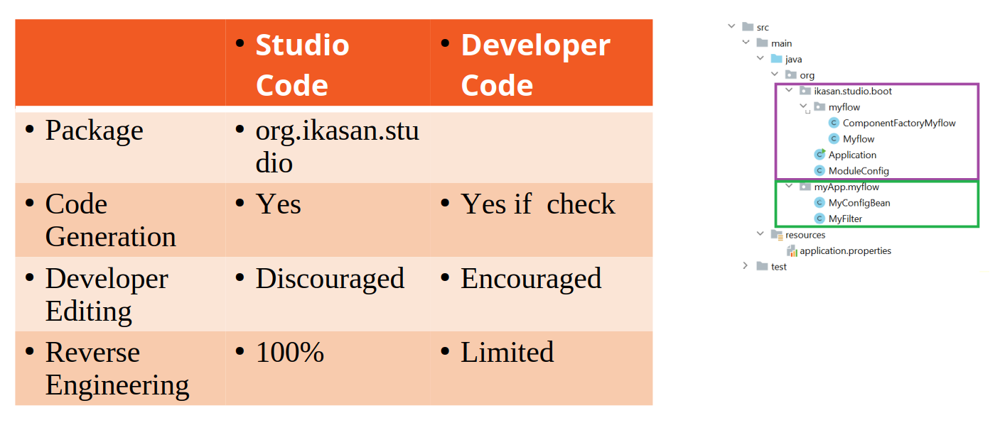

# Ikasan Studio
Ikasan Studio is a visual designer and integrated development environment for the Ikasan Enterprise Integration Platform (EIP). 

When combined as a plugin to Intellij, it provides a fully functiona, standalone IDE for designing and maintaining Ikasan modules.
## Developer Quickstart
Ikasan Studio is coming towards the end of its Beta testing phase and a formal first release is expected soon.
The formal will be available from the Intellij plugin marketplace. 
In the meantime, the plugin can be installed manually into Intellij using the instructions below.
If you encounter any issues, please raise them on the IkasanStudio github project or email me directly at david@davihilton.net
### Download the zip & jar
A prebuilt version of the plugin is available from https://github.com/ikasanEIP/IkasanStudio/blob/main/downloads/ikasanstudio-1.0.0.zip

### Install the plugin
In Intellij, locate File/Settings, on the popup window local Plugins on the left nav to display the screen below, click the Cog Wheel to the right of 'Installed', on the popup menu, choose 'Install plugin from Disk'.

Choose the location that you have stored the IkasanStudio-1.0.0.zip file and accept (note, the plugin will be copied to an internal location within the Intellij installation).

Restart Intellij

### Create a new project

#### Using Intellij
The recommended way to create new projects is via Intellij

From the main menu, choose 'File'/'New'/'Project'

From the Intellij new project wizard. Ensure you select 'Maven Archetype' on the **left nav**.

On the **main body** of the form, set the _Catalog_ field to **Maven Central**, then in the _Archetype_ field, start to type **ikasan-studio** (all **lower case**), that should be enough for auto-complete to display the full plugin name.

Once the project has been created, the standard base directories, pom.xml build files and visual palette should be generated.

In most cases, the ikasan-studio archetype will be available without any special setup, if it is not appearing in the _Archetype_ field, you may be subject to a company or local Maven refresh policy, to force a refresh of the archetypes cache, you may use the following maven command from within any Maven project (any directory that contains a pom.xml):

`mvn archetype:update-local-catalog`

Note: If you are experiancing issues creating a new project from Intellij, it is possible to create a new project manually, see Appendix A

### Creating a new Ikasan module

Observe in the project window on the left, there are 2 submodules

* generated - holds the studio auto generated code.
* user - holds the stubs generated by studio that will be implemented by the user.

On the **far right** hand side of the screen, click on the **Mr Squid** icon to reveal the Canvas and Palette.

The Palette contains new components for you to use by dragging them onto the central canvas. First though, we need to choose the version of Ikasan and 'component set' to use.

From the drop-down in the Canvas, choose meta-pack V3.3.x (**not VHS3.3.x**), then click the button to the **right** of the chooser

You should see the **Module Properties** popup below, pre-populate with the project name and version you have chosen, 
feel free to update the properties as you wish (you may want to click 'true' for the field **useEmbeddedH2** to make your startups easier, or set **flowAutoStartup** to true so that the flows start up when the module starts up). Finish by clicking the **Update Code** button.

You can now start to drag flows onto the canvas, and components onto the flows, the simplest flow involves an 'Event Generating Consumer' and a 'Logging Producer'

#### Creating a Simple Flow
First we need to add the flow, choose the flow element from the right palette and drag it onto the canvas, filling in the properties.

Now we can drag the 'Event Generating Consumer' onto the flow, again filling in the standard properties.

Finally, we can drag on the 'Logging Consumer'

This flow is complete. You can start up the Application.java from within the IDE

#### More advanced flows
There are many components in the standard palette, you are encouraged to experiment and try out different properties and components. 
Please see the YouTube library for further documentation and help.

* https://github.com/ikasanEIP
* https://www.youtube.com/@Ikasan-nq3js

* There are some performance issues due to the way Intellij is caching, they will be addressed soon.
* At the moment, the effort is being put into the backend and 'engine' so the look and feel is clunky, that will be addressed soon.

## High level design / motivations
* Scaling
  * Reduced learning time for new resources.
  * Reduced complexity for new resources.
  * Reduced time to production since most of the code is already written.
  * Simple modules can be generated directly by the business owner.
* Quality - 
  * The majority of module is code via configuration, with the underlying code / generated based on best practice implementations from the Ikasan core team.
  * The graphical representation of the module quickly exposes flaws in the business process path.
  * Opportunities for localised developer testing and debugging.
  * Configuration is subjected to validation checks reducing semantic errors.
  * Core (generated) code is subjected to enhanced automated testing.
  * Developers are focused on the exception processing, with more time to extend testing for the bespoke data transformations.
  * Core developers are focused on enhancements to the core code
  * Opportunities for daily improvement via CI against the core libraries.
  * Localised payload transformation analysis assists with production issue replication and resolution.
* Migration
  * The json model creates a layer of abstraction between the business 'application' and the underlying version of Ikasan, once standard meta-packs have been written, upgrading or downgrading versions of Ikasan can be a simple as a drop-down chooser.
* Transparency
  * The business and IT can collaborate quickly on the model generation.
  * The model diagram forms part of the delivery, by definition will always be upto date.
* Cost of ownership
  * Corporate coding standards and implementation standards enforced by the auto-generated code.
  * Consistency in implementation reduces support costs.
  * Reduction in project written code results in reduction of development time and all related QA activities
  * Upgrades between versions of Ikasan greatly simplified via json (not Java) as the source code model, reducing legacy friction and therefore legacy support costs.
  * Improvements and bug fixes to core Ikasan features can be applied with reduced / no alteration to the module configuration / bespoke code.
  * Localised developer testing and debugging reduces the reliance on expensive centralised server resource
* Flexibility 
  * Custom components or implementations can be generated by development teams, with either minor extensions or complete bespoke library of components.
  * Custom components have a lifecycle route back to the core libraries

## Version Neutral Data Model
The Module, Flows and Components are persisted using the Ikasan JSON data model, which is version neutral. This allows the Studio to be used with multiple versions of Ikasan, and for the model to be migrated between versions of Ikasan.
see https://github.com/ikasanEIP/ikasan/blob/4.0.x/ikasaneip/topology/README.md for further details.

## Application Split

Offering is split into 3 artefacts with independent lifecycles

### Core (org.ikasan.studio.core)
* Contains the model.json (de)serialisation
* Framework for code generation (ftl supplied by meta pack), 
* Framework for unit test support for meta pack, abstract support for meta pack

### Metapack (resources/studio/metapack) - depends on Core
* One per supported Ikasan version
* Reduces the number of updates to the core (UI) plugin, the metapack can be added to (almost) any version of the plugin
* Distribution / exposed via web / repo / something
* Component Library - Encapsulates the Components properties, meta-information, helptext, icons and ftl for a version of Ikasan, or an 'approach to auto-generation implementation', or user created components / code practice. 
* Provides extensive unit testing to self certify
* End user encouraged to create their own, only official metapacks are 'supported'

### UI (org.ikasan.studio.ui) - Depends on Core and Metapacks
* Business driver is cost saving resulting from standard coding of components, reduced build times, reduced migration between versions of Ikasan, reduced complexity in legacy code base
* The UI should be easy to use, intuitive, dumb down usage for junior / mid-tier devs
* Abstracted to be driven from the content of a meta pack
* Support for multiple simultaneous metapacks
* Resilient and defensive, the UI needs to accommodate developer errors (misconfigured flows or metapacks) without resulting in serious errors in the IDE (Intellij are very keen to expose even slightly wonky plugins). Where possible, the IDE should recover misconfiguration and inform the user via popup / message balloons.

## Epics / major stories

Core
* Extract the 'core' part into standard maven1 project, build into jar and expose in repo accessible by project (CAUTION - resource restrictions in official Ikasan Github).
* Create builder / Maven integration for non-UI code regeneration, integrate into maven.
* Expand out model.json to accommodate 'code hooks' and any non-standard attributes e.g. meta-pack version (organic, maybe driven by needs of UI).
* Parametrise meta pack version in build.
* Explore DB driven configuration.
* Explore how to integrate with environment configurations solutions.

Meta pack(s)
* Ikasan SME to identify the set of core Ikasan components to be supported in MVP1.
* Ikasan SME to identify review and correct all auto generated classes code properties files (ftl templates).
* Ikasan SME to identify review and correct all properties for completed components, identify as standard / advanced.
* Ikasan SME to work on ftl templates for remaining core Ikasan components.
* Split out metapack with its unit tests into separate module with dependent on code.
* Add in aggregate components with associated free marker templates.
* Add metapacks for Ikasan V4.x.
* Add metapacks for Bespoke implementations / libraries / user overrides.
* Add Junit stubs for all user generated classes.
* Support generic bespoke classes e.g. brokers, consumer, splitters etc

UI
* Split component configuration into standard with drop down advance tab.
* Rework the way mandatory components are highlighted to remove issue with 'user code regeneration' affecting components.
* Support generic bespoke classes e.g. brokers, consumer, splitters, etc.
* Expand component configuration to support beyond basic Wrapped Java types e.g. lists.
* Move component configurations to palette for shared to tabbed usage.
* Code to support user implemented and user supplied classes - integration into model.json, including 'shared' poms and properties - maybe explore multiple project roots.
* Validate current methods to run application from UI, ensure H2 config not dangerous
* Add support for wiretaps
* Review / improve handling of component deletion, auto generated and user generated.
* Single step debug mode for flows, using maybe wiretap.
* Support archetype to build the project, maybe partially implemented projects.
* Sort out icons with correct scaling and transparency to support standard IntelliJ themes.
* Update UI look and feel for all modes of Intellij themes.
* Parametrise meta pack version in model startup.
* Data exchange / XML mapping of payload for simple transitions / mappers.
* Explore DB driven configuration.
* Robustness tests.
* Eclipse, Vaaden, Javascript based IDE.

CI
* Determine how / what output from the build process are integrated into standard M processing.
* Integration with marketplace and Maven central / licence. 

Other
* Videos
* Help wiki
* Demos
* Jira ?
* Public Forum for self-help (stack overflow sub-site)

## Starting a new project ##

### Using the maven archetype from Intellij

If this does not rectify the issue, you can manually install the archetype locally using the following procedures:

### Installing the maven archetype
The archetype zip can be generated by opening a window in IkasaStudio/ikasan-studio-archetype and issuing the maven command

`mvn clean package`

This will create a jar file in the target folder with the name ikasan-studio-archetype-1.0.2-SNAPSHOT.jar

This first needs to be uploaded into your local Maven archetype library (~/.m2/repository/archetype-catalog.xml) using the following maven command:

**Unix**

`mvn install:install-file -Dfile=./target/ikasan-studio-archetype-1.0-SNAPSHOT.jar -DgroupId=org.ikasan.studio -DartifactId=ikasan-studio  -Dversion=1.0-SNAPSHOT -Dpackaging=jar`

**Windows (which needs each -D option surrounded by douple quotes)**

`mvn install:install-file "-Dfile=.\target\ikasan-studio-archetype-1.0-SNAPSHOT.jar" "-DgroupId=org.ikasan.studio" "-DartifactId=ikasan-studio"  "-Dversion=1.0-SNAPSHOT" "-Dpackaging=jar"`
(you may need to also perform mvn.cmd archetype:crawl if you can't find ~/.m2/repository/archetype-catalog.xml)

### Using the maven archetype from Intellij

If there are still issues using the archetype, it can also be used from the command line :

**Unix**

`mvn archetype:generate -DarchetypeGroupId=org.ikasan.studio -DarchetypeArtifactId=ikasan-studio -DarchetypeVersion=1.0-SNAPSHOT -DgroupId=org.me.test  -DartifactId=my-module`

**Windows (which needs each -D option surrounded by douple quotes)**

`mvn archetype:generate "-DarchetypeGroupId=org.ikasan.studio" "-DarchetypeArtifactId=ikasan-studio" "-DarchetypeVersion=1.0-SNAPSHOT" "-DgroupId=org.me.test" "-DartifactId=my-module"`

(remember so swap org.me.test and my-module for the package and module name for **your project**)

## Appendix A - Manually creating a new project

It is not recommended to use the manual method. If you are having problems with the project creation wizard, it is possible to manually create a new project using the maven archtype jar,.

1. Download and install the maven archetype from
   https://mvnrepository.com/artifact/org.ikasan.studio/ikasan-studio-project-archetype.
2. Use the standard maven process for installing the archetype locally e.g.

**Unix**

`mvn install:install-file -Dfile=./ikasan-studio-project-archetype-1.0.0.jar -DgroupId=org.ikasan.studio -DartifactId=studio-project  -Dversion=1.0.0 -Dpackaging=jar`

**Windows (which needs each -D option surrounded by douple quotes)**

`mvn install:install-file "-Dfile=.\ikasan-studio-project-archetype-1.0.0.jar" "-DgroupId=org.ikasan.studio" "-DartifactId=studio-project"  "-Dversion=1.0.0" "-Dpackaging=jar"`

(you may need to also perform mvn.cmd archetype:crawl if you can't find ~/.m2/repository/archetype-catalog.xml)

3. Now create the new project using the standard maven commands

**Unix**

`mvn archetype:generate -DarchetypeGroupId=org.ikasan.studio -DarchetypeArtifactId=studio-project -DarchetypeVersion=1.0.0 -DgroupId=org.me.test  -DartifactId=my-module`

**Windows (which needs each -D option surrounded by douple quotes)**

`mvn archetype:generate "-DarchetypeGroupId=org.ikasan.studio" "-DarchetypeArtifactId=studio-project" "-DarchetypeVersion=1.0.0" "-DgroupId=org.me.test" "-DartifactId=my-module"`

(remember so swap org.me.test and my-module for the package and module name for **your project**)

## Appendix B - Known issues
### Does not build
To get  project to build, the flows must be valid i.e. they must have at least a consumer and a producer.
### Dependencies not satisfied
When you first create a project, you may find red highlights and basic Spring dependencies are not satisfied. Use the (standard) Maven update for the project, it will re-pull the dependencies (the root casue is a threading issue inside Intellij, this will be fixed eventually)
### Deleted components are not always removed
Please work around this for now, it will be fixed shortly.

## Plugin Development Guidelines
These guidelines are for developers working on the plugin itself.
### Do not let any exceptions bubble up to Intellij
These get reported directly to the user with the recommendation to disable the plugin and report it to Idea.
Where possible, log it with a stack trace and try to recover or abort that particular operation.
### Do not use @NotNull
These bubble up to the IDE with the recommendation to disable the plugin and report it to Idea.
### Do not use anything greater than warn when using Intellij's logger
Anything greater than warn results in a stack trace reported directly to the user with the recommendation to disable the plugin and report it to Idea.
### Defensive coding is essential
You don't have to make many mistakes to get blacklisted.
### Current Branching Strategy
* **main** is used for the current development stream and producing SNAPSHOT builds.
* **1_0_x** is used for formal builds / deployment to Maven Central.

## Template ToDo list
- [x] Create a new [IntelliJ Platform Plugin Template][template] project.
- [ ] Get familiar with the [template documentation][template].
- [ ] Adjust the [pluginGroup](./gradle.properties) and [pluginName](./gradle.properties), as well as the [id](./src/main/resources/META-INF/plugin.xml) and [sources package](./src/main/kotlin).
- [ ] Adjust the plugin description in `README` (see [Tips][docs:plugin-description])
- [ ] Review the [Legal Agreements](https://plugins.jetbrains.com/docs/marketplace/legal-agreements.html?from=IJPluginTemplate).
- [ ] [Publish a plugin manually](https://plugins.jetbrains.com/docs/intellij/publishing-plugin.html?from=IJPluginTemplate) for the first time.
- [ ] Set the `MARKETPLACE_ID` in the above README badges. You can obtain it once the plugin is published to JetBrains Marketplace.
- [ ] Set the [Plugin Signing](https://plugins.jetbrains.com/docs/intellij/plugin-signing.html?from=IJPluginTemplate) related [secrets](https://github.com/JetBrains/intellij-platform-plugin-template#environment-variables).
- [ ] Set the [Deployment Token](https://plugins.jetbrains.com/docs/marketplace/plugin-upload.html?from=IJPluginTemplate).
- [ ] Click the <kbd>Watch</kbd> button on the top of the [IntelliJ Platform Plugin Template][template] to be notified about releases containing new features and fixes.

<!-- Plugin description -->
This plugin provides a visual designer and integrated development environment for the Ikasan Enterprise Integration Platform

* https://github.com/ikasanEIP
* https://www.youtube.com/@Ikasan-nq3js

<!-- Plugin description end -->
Ikasan EIP is a mature and well maintained integration platform based on industrial patterns (https://www.enterpriseintegrationpatterns.com/) to satisfy complex, disparate and demanding integration requirements of the finance sector.

## Installation

- Using the IDE built-in plugin system:
  
  <kbd>Settings/Preferences</kbd> > <kbd>Plugins</kbd> > <kbd>Marketplace</kbd> > <kbd>Search for "ikasanstudio"</kbd> >
  <kbd>Install</kbd>
  
- Using JetBrains Marketplace:

  Go to [JetBrains Marketplace](https://plugins.jetbrains.com/plugin/MARKETPLACE_ID) and install it by clicking the <kbd>Install to ...</kbd> button in case your IDE is running.

  You can also download the [latest release](https://plugins.jetbrains.com/plugin/MARKETPLACE_ID/versions) from JetBrains Marketplace and install it manually using
  <kbd>Settings/Preferences</kbd> > <kbd>Plugins</kbd> > <kbd>⚙️</kbd> > <kbd>Install plugin from disk...</kbd>

- Manually:

  Download the [latest release](https://github.com/ikasanEIP/IkasanStudio/releases/latest) and install it manually using
  <kbd>Settings/Preferences</kbd> > <kbd>Plugins</kbd> > <kbd>⚙️</kbd> > <kbd>Install plugin from disk...</kbd>

---
Plugin based on the [IntelliJ Platform Plugin Template][template].

[template]: https://github.com/JetBrains/intellij-platform-plugin-template
[docs:plugin-description]: https://plugins.jetbrains.com/docs/intellij/plugin-user-experience.html#plugin-description-and-presentation
