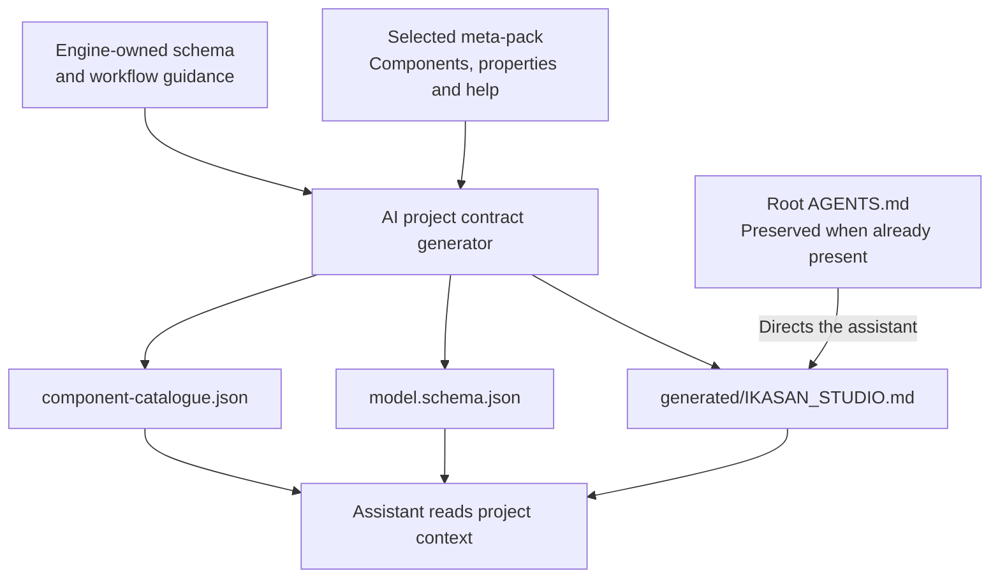

# AI-friendly projects

Studio provides an offline project contract and an optional [live MCP bridge](StudioAiBridge.md). The offline contract requires no network, MCP server or cloud connection. Start with the [AI support overview](AiSupportOverview.md) for the architecture and developer journey.

## Files and ownership

Source-generation requests (FULL, MODULE_STRUCTURE, FLOW and PROPERTIES) maintain:

- `generated/IKASAN_STUDIO.md`: model-editing workflow and ownership guidance.
- `generated/src/main/model/model.schema.json`: structural JSON Schema.
- `generated/src/main/model/component-catalogue.json`: keys, roles, implementation classes, properties, defaults, types, choices, payload contracts, recipes, supported proposal operations, `completionChecks` and `beanRequirement` guidance from the selected ComponentLibrary.
- Root `AGENTS.md`: discovery instructions, created only when missing.

MODEL_ONLY requests do not generate these files. Generated contract files participate in the source-generation transaction. The catalogue is derived automatically from the selected meta-pack. The editable model remains the source of truth; implementations under `user/` remain developer-owned.

New archetype projects include root `AGENTS.md` immediately. Other contract files appear after source generation. Existing root instructions are preserved, even if the file is empty. For a project created with the earlier empty archetype file, copy the discovery guidance into it, or remove it only if it is truly empty and regenerate. Never remove corporate or team instructions.

## How the assistant discovers project guidance

Source generation refreshes the guide, schema and catalogue locally. Root instructions point assistants towards those files without replacing existing team instructions.

The files guide the chosen client; generating them does not contact or train an AI model. Existing root instructions need to include the discovery guidance for that route to work.

## Maintenance

`AiProjectContractGenerator` owns the generated prose, schema and catalogue format.

- Component and property metadata changes automatically appear after regeneration.
- Update `modelSchema()` manually when persisted model structure changes, checking actual JSON serialization and representative saved models.
- Update `studioGuide()` when editing, validation, reload or ownership behaviour changes.
- Keep `agentsGuide()` identical to the archetype's `archetype-resources/AGENTS.md`.
- Increment `CONTRACT_VERSION` when contract format or meaning changes in a way consumers need to distinguish, especially incompatible schema or catalogue changes. Ordinary metadata refreshes and wording corrections do not require a bump. The version is emitted in the catalogue.

Unknown module, flow and component properties remain permitted to accommodate component-specific properties and future model extensions. Agents should preserve unfamiliar fields. Transition objects currently have a closed schema. Structural checks do not replace Studio's semantic validation of components, required properties, transitions, routes and meta-pack compatibility.

## Verification and AI workflows

Run `./gradlew test` and `./gradlew validateMetaPacks --no-configuration-cache` after contract changes. The focused `AiProjectContractGeneratorTest` checks every shipped meta-pack, basic schema and guidance, and consistency between archetype and generated discovery instructions. Exercise source generation in the IDE to verify the complete project-file lifecycle.

The optional [live Studio AI bridge](StudioAiBridge.md) exposes snapshots and the catalogue through MCP, validates proposed operations and applies them automatically or after review according to settings, as an undoable model change. Without MCP, agents can write proposal files into `ai-proposals/` while Studio stays open; Studio validates and applies them through the same pipeline. Prefer these routes over direct model edits. Follow the generated guide for any external-edit/reload workflow; closing and reopening the editor tab alone does not guarantee a reload.

Markdown and catalogue responses provide context to the assistant; they do not retrain its model. The generated guide covers completing custom implementations, checking actual bean registration, tracing payloads, testing generated application startup and delivery, interrupted file publication, and clean shutdown. These instructions improve the workflow but are not proof that an agent followed them: completion claims still need observed results.

## Version migration

Use Studio's **Migrate…** action for version changes rather than editing only the model's version. It previews the model, generated files and Maven changes and saves a recovery snapshot. See [Ikasan version migration](IkasanVersionMigration.md).

## Framework source references

The generated guide introduces Ikasan and maps its repository: interfaces, components, builders,
flow/module execution, recovery/exclusion, samples and documentation. The catalogue and MCP
`studio_catalogue` response expose `ikasanVersion` from the pack manifest and a `frameworkReference`
object with repository navigation, research workflow and offline fallback. Verified source links
point to `ikasaneip-3.3.9` or `ikasaneip-4.1.6` for the corresponding bundled target. Other versions
require tag verification; the generator does not invent links from custom pack IDs.

Agents are directed to use the resolved dependency version and overrides, inspect implementation
and tests, and avoid silently copying APIs from another major version. Where browsing is unavailable,
matching IntelliJ/Maven sources and class signatures provide a fallback. References do not grant
network permissions or permission to modify framework source. Refresh generated guidance through
normal Studio generation; existing developer-owned root instructions remain preserved.
