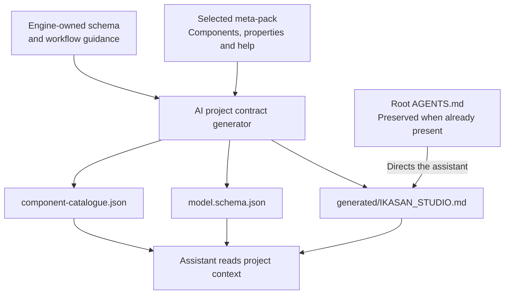

# AI-friendly projects

Studio provides an offline project contract and an optional [live MCP bridge](StudioAiBridge.md). The offline contract requires no network, MCP server or cloud connection. Start with the [AI support overview](AiSupportOverview.md) for the architecture and developer journey.

## Files and ownership

Source-generation requests (FULL, MODULE_STRUCTURE, FLOW and PROPERTIES) maintain:

- `generated/IKASAN_STUDIO.md`: model-editing workflow and ownership guidance.
- `generated/src/main/model/model.schema.json`: structural JSON Schema.
- `generated/src/main/model/component-catalogue.json`: keys, roles, implementation classes, properties, defaults, types, choices, payload contracts, recipes, supported proposal operations, `completionChecks` and `beanRequirement` guidance from the selected ComponentLibrary.
- Root `AGENTS.md`: discovery instructions, created only when missing.

MODEL_ONLY requests do not generate these files. Generated contract files participate in the source-generation transaction. The catalogue is derived automatically from the selected meta-pack. The editable model remains the source of truth; implementations under `user/` remain developer-owned.

New archetype projects include root `AGENTS.md` immediately. Other contract files appear after source generation. Existing root instructions are preserved, even if the file is empty. For a project created with the earlier empty archetype file, copy the discovery guidance into it, or remove it only if it is truly empty and regenerate. Never remove corporate or team instructions.

## How the assistant discovers project guidance

Source generation refreshes the guide, schema and catalogue locally. Root instructions point assistants towards those files without replacing existing team instructions.

The generated guide requires a short purpose/success statement before each test, immediate
updates about failures, stalls or approval restrictions, and meaningful updates at least
every 60 seconds during extended investigation. These are informational updates, not
additional approval gates; application failures must be distinguished from tooling or
access problems.

The files guide the chosen client; generating them does not contact or train an AI model. Existing root instructions need to include the discovery guidance for that route to work.

## Maintenance

`AiProjectContractGenerator` owns the generated prose, schema and catalogue format.

- Component and property metadata changes automatically appear after regeneration.
- Update `modelSchema()` manually when persisted model structure changes, checking actual JSON serialization and representative saved models.
- Update `studioGuide()` when editing, validation, reload or ownership behaviour changes.
- Keep `agentsGuide()` identical to the archetype's `archetype-resources/AGENTS.md`.
- Increment `CONTRACT_VERSION` when contract format or meaning changes in a way consumers need to distinguish, especially incompatible schema or catalogue changes. Ordinary metadata refreshes and wording corrections do not require a bump. The version is emitted in the catalogue.

Unknown module, flow and component properties remain permitted to accommodate component-specific properties and future model extensions. Agents should preserve unfamiliar fields. Transition objects currently have a closed schema. Structural checks do not replace Studio's semantic validation of components, required properties, transitions, routes and meta-pack compatibility.

## Verification and AI workflows

Run `./gradlew test` and `./gradlew validateMetaPacks --no-configuration-cache` after contract changes. The focused `AiProjectContractGeneratorTest` checks every shipped meta-pack, basic schema and guidance, and consistency between archetype and generated discovery instructions. Exercise source generation in the IDE to verify the complete project-file lifecycle.

The optional [live Studio AI bridge](StudioAiBridge.md) exposes snapshots and the catalogue through MCP, validates proposed operations and applies them automatically or after review according to settings, as an undoable model change. Without MCP, agents can write proposal files into `ai-proposals/` while Studio stays open; Studio validates and applies them through the same pipeline. Prefer these routes over direct model edits. Follow the generated guide for any external-edit/reload workflow; closing and reopening the editor tab alone does not guarantee a reload.

Markdown and catalogue responses provide context to the assistant; they do not retrain its model. The generated guide covers completing custom implementations, checking actual bean registration, tracing payloads, testing generated application startup and delivery, interrupted file publication, and clean shutdown. These instructions improve the workflow but are not proof that an agent followed them: completion claims still need observed results.

## Version migration

Use Studio's **Migrate…** action for version changes rather than editing only the model's version. It previews the model, generated files and Maven changes and saves a recovery snapshot. See [Ikasan version migration](IkasanVersionMigration.md).

## Framework source references

The generated guide introduces Ikasan and maps its repository: interfaces, components, builders,
flow/module execution, recovery/exclusion, samples and documentation. The catalogue and MCP
`studio_catalogue` response expose `ikasanVersion` from the pack manifest and a `frameworkReference`
object with repository navigation, research workflow and offline fallback. Verified source links
point to `ikasaneip-3.3.9` or `ikasaneip-4.1.6` for the corresponding bundled target. Other versions
require tag verification; the generator does not invent links from custom pack IDs.

Agents are directed to use the resolved dependency version and overrides, inspect implementation
and tests, and avoid silently copying APIs from another major version. Where browsing is unavailable,
matching IntelliJ/Maven sources and class signatures provide a fallback. References do not grant
network permissions or permission to modify framework source. Refresh generated guidance through
normal Studio generation; existing developer-owned root instructions remain preserved.

## ESB lifecycle acceptance

Generated guidance treats ESB flows as long-lived services, including demonstrations.
An exhausted sample list must not make the normal application stop its flows. Agents must
verify delivery, continued readiness during idle time, and delivery of later input without
resetting beans or restarting flows. Returning null from an Event Generating Consumer's
provider ends that source; it is not a way to wait for input. Paced/custom sources must use
the selected framework's lifecycle correctly and support cancellation and cleanup.
Explicit batch requirements and bounded test fixtures are exceptions. Documentation of an
unexpected stop does not turn it into successful ESB behaviour. This is an acceptance
requirement for agent implementations, not automatic runtime repair by Studio.

## Local test-environment context

New archetype projects include developer-owned `LOCAL_TEST_ENVIRONMENT.md`. Studio also creates
it after Maven import when opening a recognised Ikasan project, before module configuration,
including projects from older archetypes. Normal generation retries creation if absent. Existing
content and editor changes are preserved. The creation
page and startup checklist ask developers to review it. Root `AGENTS.md` and the refreshed generated
guide direct agents to reread it for every task needing test settings, respect permitted operations,
and ask about missing values instead of inventing endpoints or credentials.

The template is a paste-friendly `name=value` block for SFTP, FTP, SMTP and JMS. Fill only the
settings you need. Literal local-test passwords are supported; environment references are optional.
No READY flag is required. Missing optional values retain existing settings or selected-catalogue
defaults. The AI asks for missing required details and chooses coherent flow behaviour from the brief.
For file pairs, `sftp.directory` / `ftp.directory` map to both ends' server-visible directory.

The file is AI context, not automatically loaded runtime configuration. Agents must read project
files and apply supported Studio properties or wire the actual runtime configuration. Studio does
not parse this block or inject it into MCP snapshots. Existing root instructions and environment
files are preserved; generation refreshes `generated/IKASAN_STUDIO.md` with the current rules.
Older environment files can be replaced manually with the
[current template](../ikasan-studio-ancillary/ikasan-studio-project-archetype/src/main/resources/archetype-resources/LOCAL_TEST_ENVIRONMENT.md)
after retaining any supplied values. This also removes the earlier references-only guidance.

The archetype packages the Markdown without Velocity filtering, preserving `${...}` examples.
Add `/LOCAL_TEST_ENVIRONMENT.md` to the root `.gitignore` for machine-specific values; Studio leaves
existing ignore rules unchanged. Verify real runtime delivery; settings alone are not test evidence.

## Integration workflow skill

The project skill **ikasan-integration-workflow** turns an application brief into an acceptance
inventory, then guides model proposals, implementation and runtime verification. It also supports
read-only reviews. It reads the current generated contract and catalogue rather than duplicating
operation schemas or hard-coding a particular demonstration. Its acceptance checks distinguish
first delivery from continued ESB readiness and later delivery without restarting the application.

The maintained workflow is `.agents/skills/ikasan-integration-workflow/SKILL.md`.
A small `.claude/skills/ikasan-integration-workflow/SKILL.md` entry points to the same file.
These are project-scoped discovery locations documented for [Codex skills](https://developers.openai.com/codex/skills/)
and [Claude Code skills](https://code.claude.com/docs/en/skills). Native discovery depends on the
client, not merely on using a Codex or Claude model. In particular, availability through an IDE
agent integration must be checked in that client. Root `AGENTS.md` and the generated guide tell
clients with file access to read the shared workflow explicitly if necessary.

New archetypes include both files without template filtering. Studio generation creates them
for existing projects when missing and preserves customisations. Existing skill files are not
automatically upgraded; review and merge later template improvements deliberately. The skill
consults `LOCAL_TEST_ENVIRONMENT.md` for settings, and the generated guide/catalogue for current
capabilities. These remain separate sources of configuration and technical reference. The skill
grants no extra permissions and does not bypass proposal validation or approval policy.

Example request: “Use the ikasan-integration-workflow skill to implement this brief and report
which paths were verified through the normal Run module configuration.” For a review, explicitly
say whether repairs are authorised. Structural validation, packaging tests and edit-preservation
tests cover the shipped files; successful discovery and improved outcomes in a particular IDE
client still need to be exercised with a real task. A skill is guidance, not an enforcement layer.

## Efficient verification and generator recovery

The generated guide and integration skill ask agents to check service availability, payload types and
transaction needs before constructing dependent flows, prove one example per distinct pattern, batch
related repairs, and finish with a single whole-module verification after focused checks pass.

Scheduled Consumer `messageProvider` implementations now belong in `user/` and include a compilable
`invoke(JobExecutionContext)` method. The default method returns the timer context; implement the
business payload before claiming the flow complete. Regeneration preserves existing implementations.
If an older project has the same provider under `generated/src/main/java`, move it to the same package
under `user/src/main/java`, retaining any implementation, then regenerate. Studio reports this case
rather than overwriting the old file or creating a duplicate. Obsolete providers from previously
replaced components are not automatically deleted.

Explicit numeric zero is a supplied value, not an unset field. Filename regular-expression brackets
are preserved. Logging formatting uses separate builder calls for both bundled framework versions.
These fixes remove the need to change zero to one, weaken filename matching, or replace logging
producers with listeners merely to avoid those generation defects.

## Efficient small demonstrations

The generated AI contract asks agents to check that Studio has finished initial configuration
and generated the model/catalogue before submitting proposals. Agents should inspect the selected
component entries and relevant properties/recipes instead of dumping the entire catalogue, and
verify small demonstrations together where practical without weakening per-path delivery checks.

The V3.3.9 Logging Producer catalogue documents a replacement-pattern initialization limitation:
`LogProducerBuilderImpl.setRegExpPattern()` mutates the configuration, while `LogProducer` compiles
its pattern in `setConfiguration()`. Custom labels must be checked against actual output; plain
payload logging is sufficient when labels are not required. This note is not applied to other
versions without checking their implementation.

The contract also records the observed Ikasan 3.3.9 context-close worker-retention issue as an
investigation lead. Agents must distinguish application delivery from shutdown verification and
context closure from the actual normal process-stop path. They should preserve reproducible
shutdown failures without repeatedly investigating an unchanged symptom, or treating a forced
exit as successful graceful shutdown. Framework observations do not excuse application failures.

## Focused catalogue and reusable tests

`studio_catalogue` accepts optional `componentKeys` on both MCP routes. For example,
`{"componentKeys":["Converter","Spring JMS Producer"]}` returns only those complete
component definitions. `{"componentKeys":[]}` returns version/source metadata and
`availableComponentKeys` without component details. Omitting the argument retains the
full catalogue. Keys are exact and case-sensitive; unknown keys produce an actionable
error rather than silently omitting a requested component. File-based clients can filter
`generated/component-catalogue.json` locally.

See [Ikasan flow testing](IkasanFlowTesting.md) for version-pinned framework examples,
real-payload assertions and test lifecycle guidance. The catalogue's
`frameworkReference.flowTesting` also directs connected agents to these references.
