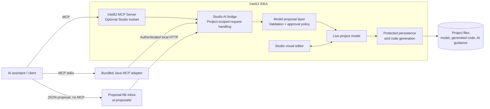
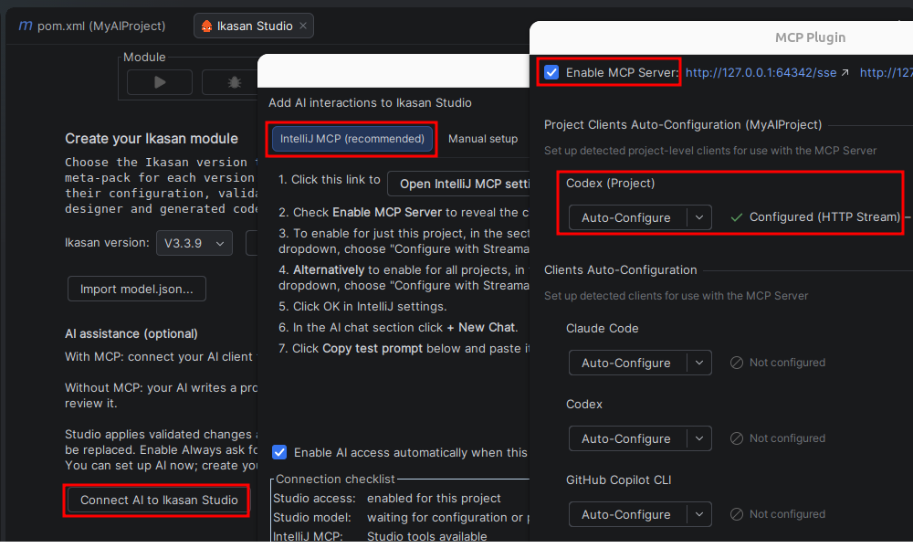
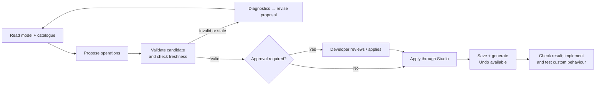

# 1AI support in Ikasan Studio

*A quick overview for developers and managers · September 2026*

Ikasan Studio lets an AI assistant help build an integration **through the same model that the visual editor uses**. A developer describes the outcome; the assistant discovers available components, proposes structured changes, completes authorised custom code and verifies behaviour. Studio owns model validation, application, persistence and code generation. Developers can work with or without an MCP connection, retaining the same model safeguards.

## 1. Architecture: one model, two ways in

This architecture view shows logical components inside the plugin, rather than separate deployable containers. The AI client may run inside IntelliJ or separately; Studio does not bundle an AI model, subscription or cloud service.

**Connected route.** On supported IDEs, Studio contributes four tools to IntelliJ's bundled MCP Server (Model Context Protocol). Alternatively, the bundled Java adapter exposes MCP over stdio and forwards requests to Studio's private, token-authenticated loopback service. That private service is not a public Streamable HTTP MCP endpoint.

| Tool                     | Purpose                                                              |
| ------------------------ | -------------------------------------------------------------------- |
| `studio_snapshot`        | Read the live model and its revision.                                |
| `studio_catalogue`       | Discover the selected version's components, properties and guidance. |
| `studio_propose`         | Submit structured operations for validation and application/review.  |
| `studio_proposal_status` | Check review, generation, completion, failure or undo status.        |

**Without MCP.** The assistant reads the saved model and generated guidance, then writes a `*.studio-proposal.json` file under `ai-proposals/`. Studio discovers it and applies the same validation and approval policy. A saved-model hash guards against stale proposals. A persistent review banner appears when attention is needed; **Tools → Review Latest AI Proposal** and **Import AI Proposal into Ikasan Studio…** provide explicit access. The assistant must reread the saved result before claiming success; a proposal file alone is not an applied change.

## 2. Getting connected and making changes

Choose  on the **Create your Ikasan module** page, or later via

**Tools → Connect AI to Ikasan Studio…** / IntelliJ **Find Action**.

Access can be enabled before module configuration; model tools explain when Studio is not yet ready.

In the connection dialog, choose

* IntelliJ MCP - This is the recommended configuration for the tightest integration
* Manual setup - This offers the same level of integration as 'IntelliJ MCP' but contains more manual steps
* Proposal file (no MCP) - Uses the same validation and approval policy, without a connected MCP client

For **IntelliJ MCP (Recommedned)** option, open the linked settings and check **Enable MCP Server**. Find your client in **Clients Auto-Configuration** (for reusable client setup), or **Project Clients Auto-Configuration** (for project-specific setup). Select **Configure with Streamable HTTP transport** where offered, then save settings. Start a fresh/reconnected client session (this can be as simple as clicking the **+ new chat button**) and paste **Copy test prompt** into it. The checklist confirms a successful Studio read, not merely that settings were opened. Studio access remains project-specific even with reusable client configuration.

Automatic access on project reopening is selected by default when connecting. Closing the dialog keeps access enabled; **Stop bridge** disables it and automatic reconnection.

In **Settings → Tools → Ikasan Studio**, **Always ask for approval** defaults to **off**; **Confirm deletes** defaults to **on**, covering flow/component deletion and component replacement. Potential developer-code replacement always requires review. Validation and freshness checks still run for automatic changes. Generation failures are reported explicitly; an applied model may remain for correction or undo. Studio's model undo does not encompass separate AI edits to custom Java.

**The model boundary.** The bridge transports requests; `ModelProposal` validates operations on an isolated draft, and `StudioAiService` enforces approval policy and checks that the live model has not changed. Accepted changes update the live model with Undo/Redo support. `ComponentIO` and `ProtectedModelFileWriter` validate and safely persist its JSON representation, with rotating backups. This is a controlled Studio editing path, not a filesystem access restriction or proof of correct runtime behaviour. See [validation, approval and persistence layers](StudioAiBridge.md#validation-approval-and-persistence-layers) for responsibilities and failure boundaries.

## 3. How the assistant learns the project

We supply **project context, not model training**. These files and tool responses guide whichever assistant the developer chooses; their effectiveness depends on the client reading and following them.

| Context                                         | What it teaches                                                                                                          |
| ----------------------------------------------- | ------------------------------------------------------------------------------------------------------------------------ |
| Root`AGENTS.md`                                 | Where to discover Studio instructions; model and code ownership.                                                         |
| `generated/IKASAN_STUDIO.md`                    | MCP/file workflows, proposal format, completion and verification checks.                                                 |
| `ikasan-integration-workflow` skill | Task workflow for proposals, implementation, reviews and evidence of delivery plus continued readiness. |
| `LOCAL_TEST_ENVIRONMENT.md` | Developer-owned test endpoints, credential references, prerequisites and permitted operations; reread for each test-configuration task. |
| `model.schema.json`                             | Persisted model structure.                                                                                               |
| `component-catalogue.json` / `studio_catalogue` | Exact component keys, payload types, properties, defaults, recipes, supported operations and implementation obligations. |

The schema and catalogue files sit beside `generated/src/main/model/model.json`. Their catalogue content comes from the selected meta-pack, keeping advice aligned with the target Ikasan version. Generation refreshes the generated contract; existing root `AGENTS.md` instructions are preserved.

Guidance asks assistants to finish authorised custom implementations under `user/`, locate real Spring beans, trace payloads across paired flows, and preserve existing developer logic. It separates compilation, component tests, generated-application startup, delivery and clean shutdown. File-output checks cover interrupted writes and retries. External service setup and untested paths must be reported explicitly: a completed diagram or successful build is not proof of working integration.

**Current boundaries.** AI operations support incremental linear and branched flows, single- and multi-recipient routers, named routes, flow-wide exception rules, properties, component renaming/deletion/replacement, ordering and whole-flow deletion. Populated branches cannot be removed or renamed through route configuration; shared downstream merges, flow renaming and version migration still use Studio's UI. Recognised credential fields are redacted from snapshots; other model text is shared with the client and may be processed by its chosen AI provider. This is not comprehensive secret detection.

For setup and operation details, see [Studio AI bridge](StudioAiBridge.md); for contract generation and ownership, see [AI-friendly projects](AiFriendlyProjects.md). Implementation centres on `intellij.ai`, the optional `native-mcp` module, framework-independent `core.ai`, and `AiProjectContractGenerator`.
