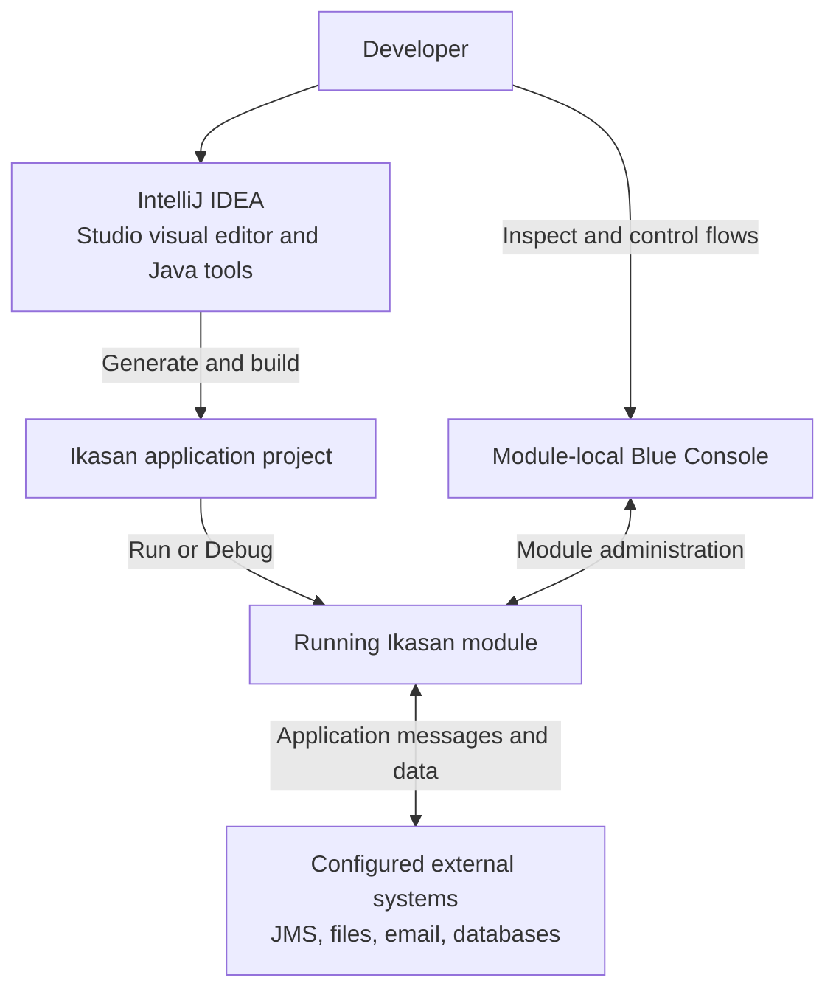

# Your first module in five minutes

This walkthrough creates a scheduled flow that writes to the application log. Allow extra time for the first Maven downloads and IntelliJ indexing; the five minutes starts with the plugin, project JDK and dependencies ready.

## Where Studio fits

Studio helps build the application inside IntelliJ; the running module connects to your integration endpoints. Console opens that module's Blue Console.

The first example below uses only a timer and logging; it does not need those external systems.

## Before you start

Install the candidate plugin ZIP using **Settings → Plugins → gear → Install Plugin from Disk**, then restart if prompted. Use [Supported versions](SupportedVersions.md) to choose an IDE and project JDK. These instructions describe the current candidate.

## 1. Create the project

Choose **File → New → Project → Maven Archetype**. Select Maven Central and search for `org.ikasan.studio:ikasan-studio-project-archetype`. Give the project a name and choose the JDK for your intended Ikasan version. If the catalogue cannot resolve the archetype, see [Troubleshooting](Troubleshooting.md); do not substitute an unrelated archetype.

Wait for Maven import and indexing. Studio opens in an editor tab. To reopen it, click the squid icon on the far-right stripe, use **Tools → Ikasan Studio → Open Ikasan Studio**, or search for that action using Find Action.

## 2. Configure the module

Choose **V3.3.9** or **V4.1.6**, matching your project JDK. Open module configuration using the control beside the version chooser. Give the module a name. For this local example, enable **useEmbeddedH2** and leave **flowStartupType** as **AUTOMATIC**. Apply with **Update Code** and allow Maven to resolve the generated project.

Before configuring external test services, review **LOCAL_TEST_ENVIRONMENT.md** in the project root.
New archetype projects include it; Studio also creates it after Maven import before module
configuration if missing. Paste only the `name=value` pairs for your test services. Literal local-test
passwords are accepted; environment-variable references are optional. Leave unneeded fields blank:
the AI preserves existing settings or uses applicable catalogue defaults and asks only for missing
required details. For SFTP, provide the host, username, existing remote directory and either a
password or existing private-key/known-hosts filenames. The file is AI context, not automatically
loaded runtime configuration. Add `/LOCAL_TEST_ENVIRONMENT.md` to `.gitignore` for local values.

## 3. Build the flow

Drag a **Flow** from the palette onto the canvas and name it `HelloFlow`. Add a **Scheduled Consumer**, followed by a **Logging Producer**. Give each a distinct name. On the consumer, set **cronExpression** to `*/5 * * * * ?` (every five seconds), leave **messageProvider** unset to use the built-in Quartz provider, and leave **eager** false. Apply each property form with **Update Code** and complete any mandatory fields highlighted by the selected pack.

This example needs no JMS broker, FTP server or email account. The built-in provider emits a Quartz job context (a timer event), which the Logging Producer accepts; no converter or custom Java is needed.

## 4. Run and inspect

Click **Run module**. Studio selects or creates an IntelliJ Application run configuration. Wait for the application startup message in the Run console, then look for the flow's logging output. A launched process alone does not mean startup has finished.

Open **Console** to view the module-local **Blue Console**. The local example login is `admin` / `admin`. Check that `HelloFlow` is running. The Blue Console is distinct from the central Ikasan Dashboard.

To inspect source, use a component's **Jump to Code** or **Jump to Properties** action when offered. Pending property changes do not need to be accepted merely to inspect an available navigation target.

## 5. Debug and stop

Stop the Run session, add a **Debug** component between the consumer and producer, apply **Update Code**, and use **Jump to Code** to set a breakpoint in its `debug()` method, and start **Debug module** or debug the selected Application configuration using IntelliJ's controls. Resume execution after inspecting the event. Stop the application through the Run/Debug window when finished.

You now have a saved visual model and generated application. Keep `generated/src/main/model/model.json` in version control. Read [Project files and recovery](ProjectFilesAndRecovery.md) before editing generated Java, and [Harnesses](Harnesses.md) when adding external endpoints.

## More room for the canvas

Use **Hide panels** at the top-right of the designer to hide Properties and Palette.
The same button becomes **Show panels**, restoring their previous width and selected tab.
Pending property edits are preserved; hiding the panels does not apply them.
