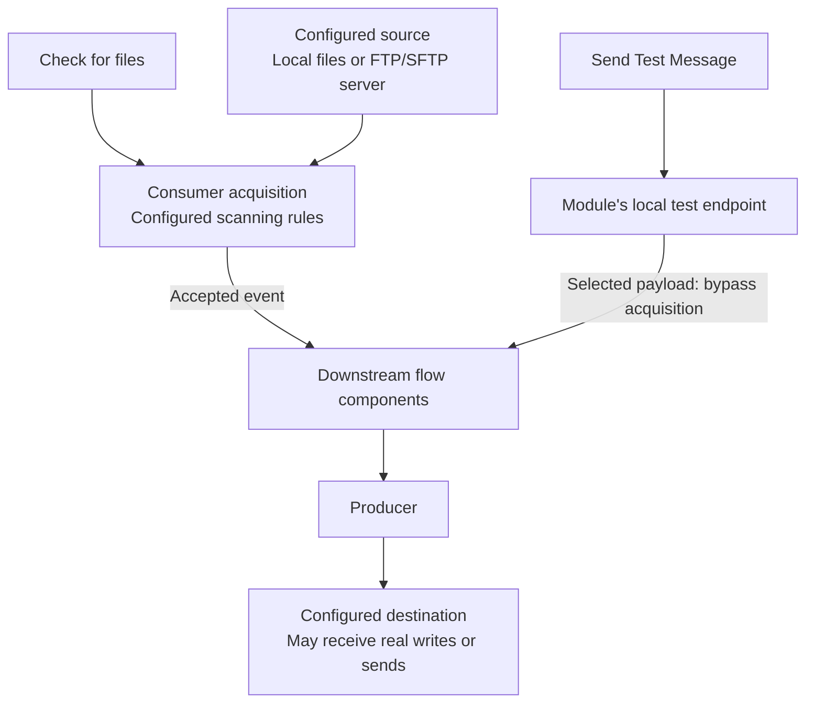

# Testing with harnesses

Harnesses support local development. Start with a disposable project and test endpoints, apply **Update Code**, and restart the module whenever generated configuration changes. Actions are shown only for components and states that support them. Toolbar harness start/stop controls manage the module's FTP and mail test harnesses; they do not start a JMS broker or the application.

## AI-assisted demonstrations

The generated `IKASAN_STUDIO.md` and new `LOCAL_TEST_ENVIRONMENT.md` templates explain
that these servers are started explicitly in Studio. A closed port during implementation is not
proof of missing infrastructure. Agents should ask the developer to start the appropriate harness,
confirm its details, keep flows AUTOMATIC, and verify delivery afterwards. A demo awaiting a
harness is incomplete; disabling its flows hides the outstanding setup.

## Email

Right-click an Email Producer or its endpoint and choose **Start Test Mail Server**. Studio starts MailHog in a **Test Mail Server** Terminal tab and opens its web inbox. The SMTP address follows the supported local producer configuration; **Show Test Mail Server Details** shows the address and inbox. If prompted to align other producers with this address, review the proposed change and restart the module after regeneration.

The web inbox is at `http://127.0.0.1:8025`. Use **Stop Test Mail Server**, or stop the process in its Terminal tab. Studio will not replace or stop an unrelated listener it cannot establish ownership of.

MailHog captures mail locally. Producers still configured for a real SMTP server continue using that server. The first start downloads MailHog v1.0.1 from GitHub and caches its executable in IntelliJ's system directory. Platform support follows the available MailHog binaries; macOS uses the Intel binary and Apple Silicon requires an appropriate translation environment. A download, execution or port failure appears in notifications or the Terminal output.

## FTP and SFTP

For a supported local FTP Consumer or Producer, choose **Start Test FTP Server**, then **Show Test FTP Server Details**. The details provide the configured address, credentials and test-file location. The server includes `test-file.txt`; use **Show Test FTP Directory** to add test files, or **Open Test FTP File** to inspect the example. A consumer's source directory is `/` within the harness root. Configure producer output paths to match the test server's directories.

For a paired demonstration, use `/` for both the producer output and consumer source unless you have created a subdirectory through **Show Test FTP Directory**. A remote `/studio-demo` means `studio-demo` inside the harness root, not a directory in your source project. Verify it exists and the account can list, read, write and rename there before starting either flow. A producer's create-parent-directory option does not guarantee the directory exists before a consumer polls. `ClientCommandCdException` means directory access failed; check the path and permissions.

Use **Stop Test FTP Server** when finished. The server is project-owned and stops on project disposal. Its files live under IntelliJ's system directory, not your source project; copy anything worth retaining elsewhere. Only one FTP server configuration is active per project. TCP ports remain shared across projects.

This is a plain FTP harness, **not an SFTP or FTPS server**. Testing actual SFTP transport requires your own SFTP endpoint. Sending a synthetic payload downstream does not test that endpoint's connectivity, authentication or scanning.

## JMS readers

On a supported JMS Producer, choose **Create test JMS consumer flow**. New readers divert that producer to a private test destination. Restart the module to activate the change. Run in Debug mode and use **Jump to Debug Component** on the harness node to place a breakpoint and inspect messages.

Messages are consumed, not copied, forwarded or replayed. Messages already on the original destination can still reach its normal consumers. Older readers created without diversion share the original destination. Use **Message Consumption Warning...** for the relevant warning. Remove the reader using **Remove test harness**, then regenerate/restart to restore the producer's configured destination. The reader still needs a functioning JMS provider; it is not an embedded broker. See [JMS object messages](JmsObjectMessages.md) for serialization and trusted-package requirements.

## Send a message or trigger a real scan

Start **Debug module**, wait for startup, then use **Send Test Message** on a supported Consumer. This sends a chosen payload into downstream processing through the running module's local Studio endpoint. Selected FTP/SFTP payloads bypass remote scanning and duplicate detection. Selected local files bypass scheduled discovery, filename matching and post-processing, and must be readable by the module process.

Use **Check for files** to exercise the real scheduled consumer acquisition path. For local files, **Show scan directory** identifies the running configuration. Normal minimum file age, filename patterns and duplicate detection still apply; FTP/SFTP defaults can ignore files younger than 120 seconds. Confirmation means the asynchronous scan was requested, not that a file was delivered. Default and custom Scheduled Consumer message providers still determine the event produced by a real trigger.

Harness success checks the exercised path only. Test error handling, retries, credentials, TLS, transport semantics and business transformations against representative external systems before deployment. Debug copy helpers do not guarantee isolation of mutable payloads.

### Two different test paths

For supported file consumers, a real scan exercises acquisition rules. Synthetic injection starts downstream processing with a selected payload.

A successful injected message does not verify source connectivity, filename filters, duplicate detection or post-processing. Neither path substitutes for checking the received result.

### SFTP identities

Existing private keys commonly live under the user home in `.ssh` (for example `id_rsa` or `id_ed25519`), and trusted host entries in `.ssh/known_hosts`. Confirm the actual identity, connector format support and server authorization; filenames are not guarantees. Use resolved absolute paths readable by the module process, not an unexpanded `~` or an invented project-local key. Keep private keys out of source control and AI messages. Verify server fingerprints through a trusted source; collecting a key with `ssh-keyscan` alone does not authenticate it.

### Browse SFTP directories

Right-click an SFTP Producer or Consumer, or its external endpoint icon, and choose **Browse remote files…**.
The browser starts with the producer's `outputDirectory` or consumer's `sourceDirectory`,
using that component's host, port, username and authentication settings. It connects directly
from the IDE; the module does not need to be running, and directories can be outside the project
or on another machine.

Review the connection dialog before connecting. Overrides apply only to that browser and are
not saved to the model. Replace `${…}` placeholders with actual values: the browser does not
load the module's runtime environment, Spring profiles, or custom directory URL factories.
A password takes precedence over a private key; clear it to use the key, and enter its
passphrase if necessary. Local key and known-host paths accept `~/` and project-relative paths.
The server must already have a trusted entry in the selected `known_hosts` file (default
`~/.ssh/known_hosts`). Unknown or changed host keys are rejected; verify fingerprints through
a trusted channel before updating that file. SSH agent and jump-host configuration are not
imported from OpenSSH configuration.

- Double-click a directory, enter a path and choose **Go**, or use **Up** and **Refresh**.
- Select a regular file and choose **Download…**, then a local folder. Existing local files
  are never overwritten.
- Select regular files and choose **Delete Files…**. Confirm the server, directory and filenames
  before deletion. This is permanent and cannot be undone. Directories and symbolic links
  cannot be downloaded or deleted through this browser.

Network operations run in the background; closing the browser cancels its current request.
Listings are limited to 10,000 entries, with a visible message when truncated. Refresh after
external changes or a failed operation. A batch deletion can partially succeed; review its
reported count and refresh the listing before retrying. Files may also be consumed, moved or
recreated by a running flow while the browser is open.

Deleting remote files does **not** clear persisted duplicate-detection records. Use
**View File Duplicate History…** separately when investigating why a consumer ignores a file.
Browsing verifies access with the browser's settings; it does not prove delivery by the module.

### Finite sample sources

An Event Generating Consumer stops producing when its provider returns `null`. A finite sample
can therefore show **Stopped** after successful delivery. Check the expected received messages
and errors before treating this as a startup failure. Starting the flow again does not reset a
stateful provider automatically; document and test its replay mechanism. For an ongoing visual
demonstration, a paced Scheduled Consumer may be more appropriate. Do not use an unbounded fast
loop simply to keep a flow marked Running.

## Inspect locally excluded events

With the module running, right-click the module or a flow in Studio and choose **View Excluded
Events...**. A flow action pre-fills its name; clear the filter to search all flows. Refresh,
Previous and Next browse 20 records per page. Optional date filters use
`yyyy-MM-dd'T'HH:mm:ss` in the module server's timezone.

The read-only viewer queries the module's `/rest/exclusion/` API, not H2 directly or the
Dashboard. It shows time, flow, event identifier and harvested status for records still retained
locally. Selecting a row shows its error URI and stored event. Readable UTF-8 is previewed;
binary/serialized events are shown as Base64 without deserializing application objects.
Previews are limited to 32,768 characters and responses to 4 MiB. Narrow the search if a response
is too large. The viewer does not replay, delete or mark events harvested.

Like Studio's existing runtime controls, this uses localhost, the configured module HTTP port
and generated context path, with the seeded `admin/admin` account. Changed credentials or
missing `ALL`/`WebServiceAdmin` authority produce an access-denied message; custom credentials
are not currently configurable in this viewer. Start the module and wait for startup before
refreshing. Local retention/housekeeping determines what remains visible after harvesting.

## Inspect file duplicate history

Right-click the module and choose **View File Duplicate History...** while it is running.
Alternatively, right-click an FTP or SFTP consumer to open the same viewer with its configured
`clientID` already filled in. The filter remains editable: runtime configuration overrides can
make the running value differ from the Studio model. The module action starts with all clients.
The read-only viewer uses `/rest/filefilter/search`, available in the supported Ikasan 3/4
sources, to show retained FTP/SFTP file-transfer filter records. Search by client ID or file
path/criteria, with `%` for any text and `_` for one character; leave filters blank for all.
Pagination displays 20 records at a time, with size, last-modified and record-created timestamps.
Select a row for its ID, last-accessed value and an explanation of duplicate matching.

When duplicate filtering is enabled, the connector checks client ID and size, plus path and
last-modified time according to its configured matching flags. These are retained filter
records, not failed-event exclusions, proof of final delivery, or an audit of every skipped scan.
The API does not provide a flow-name mapping or a live explanation for a particular remote file;
use the consumer configuration and stored values together. Filename patterns and minimum age
can also prevent pickup. Local-file consumers may use different acquisition state and are not
covered by this FTP/SFTP store viewer.

Like the exclusion viewer, this uses the module-local runtime connection and seeded admin
credentials, and is bounded to a 4 MiB response. It cannot delete records or reset duplicate
protection. No direct H2 access or Dashboard is required. The framework owns retention and
paging order, so refresh from the first page if records change while browsing.

## Inspect wiretap captures

Right-click the module, a flow or a component and choose **View Wiretap Events...**.
Flow and component actions prefill the corresponding filters. Enable wiretap capture using
Studio's wiretap controls and process events, then click **Refresh**. An empty page can mean
capture was not enabled, filters do not match, or records have expired/been removed.

The read-only viewer uses the module-local `/rest/wiretap/` API supported by Ikasan 3/4.
It displays the newest captures first, 20 per page, with flow, component, event ID and harvested
status. Select a row for its record ID, related event ID and stored text payload (up to 32,768
characters). Payloads are displayed as plain text, never executed or deserialized.
Optional date filters use the module server's timezone. Existing runtime-viewer credentials,
timeouts and the 4 MiB response limit apply. The module must be running; Dashboard and direct
H2 access are not required. The viewer does not create triggers, replay or delete events.
