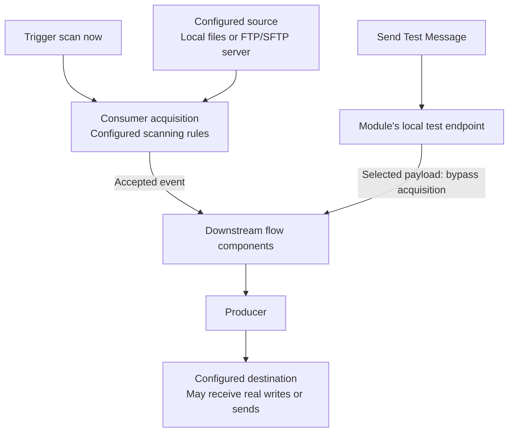

# Testing with harnesses

Harnesses support local development. Start with a disposable project and test endpoints, apply **Update Code**, and restart the module whenever generated configuration changes. Actions are shown only for components and states that support them. Toolbar harness start/stop controls manage the module's FTP and mail test harnesses; they do not start a JMS broker or the application.

## AI-assisted demonstrations

The generated `IKASAN_STUDIO.md` and new `LOCAL_TEST_ENVIRONMENT.md` templates explain
that these servers are started explicitly in Studio. A closed port during implementation is not
proof of missing infrastructure. Agents should ask the developer to start the appropriate harness,
confirm its details, keep flows AUTOMATIC, and verify delivery afterwards. A demo awaiting a
harness is incomplete; disabling its flows hides the outstanding setup.

## Email

Right-click an Email Producer or its endpoint and choose **Start Test Mail Server**. Studio starts MailHog in a **Test Mail Server** Terminal tab and opens its web inbox. The SMTP address follows the supported local producer configuration; **Show Test Mail Server Details** shows the address and inbox. If prompted to align other producers with this address, review the proposed change and restart the module after regeneration.

The web inbox is at `http://127.0.0.1:8025`. Use **Stop Test Mail Server**, or stop the process in its Terminal tab. Studio will not replace or stop an unrelated listener it cannot establish ownership of.

MailHog captures mail locally. Producers still configured for a real SMTP server continue using that server. The first start downloads MailHog v1.0.1 from GitHub and caches its executable in IntelliJ's system directory. Platform support follows the available MailHog binaries; macOS uses the Intel binary and Apple Silicon requires an appropriate translation environment. A download, execution or port failure appears in notifications or the Terminal output.

## FTP and SFTP

For a supported local FTP Consumer or Producer, choose **Start Test FTP Server**, then **Show Test FTP Server Details**. The details provide the configured address, credentials and test-file location. The server includes `test-file.txt`; use **Show Test FTP Directory** to add test files, or **Open Test FTP File** to inspect the example. A consumer's source directory is `/` within the harness root. Configure producer output paths to match the test server's directories.

For a paired demonstration, use `/` for both the producer output and consumer source unless you have created a subdirectory through **Show Test FTP Directory**. A remote `/studio-demo` means `studio-demo` inside the harness root, not a directory in your source project. Verify it exists and the account can list, read, write and rename there before starting either flow. A producer's create-parent-directory option does not guarantee the directory exists before a consumer polls. `ClientCommandCdException` means directory access failed; check the path and permissions.

Use **Stop Test FTP Server** when finished. The server is project-owned and stops on project disposal. Its files live under IntelliJ's system directory, not your source project; copy anything worth retaining elsewhere. Only one FTP server configuration is active per project. TCP ports remain shared across projects.

This is a plain FTP harness, **not an SFTP or FTPS server**. Testing actual SFTP transport requires your own SFTP endpoint. Sending a synthetic payload downstream does not test that endpoint's connectivity, authentication or scanning.

## JMS readers

On a supported JMS Producer, choose **Create test JMS consumer flow**. New readers divert that producer to a private test destination. Restart the module to activate the change. Run in Debug mode and use **Jump to Debug Component** on the harness node to place a breakpoint and inspect messages.

Messages are consumed, not copied, forwarded or replayed. Messages already on the original destination can still reach its normal consumers. Older readers created without diversion share the original destination. Use **Message Consumption Warning...** for the relevant warning. Remove the reader using **Remove test harness**, then regenerate/restart to restore the producer's configured destination. The reader still needs a functioning JMS provider; it is not an embedded broker. See [JMS object messages](JmsObjectMessages.md) for serialization and trusted-package requirements.

## Send a message or trigger a real scan

Start **Debug module**, wait for startup, then use **Send Test Message** on a supported Consumer. This sends a chosen payload into downstream processing through the running module's local Studio endpoint. Selected FTP/SFTP payloads bypass remote scanning and duplicate detection. Selected local files bypass scheduled discovery, filename matching and post-processing, and must be readable by the module process.

Use **Trigger scan now** to exercise the real scheduled consumer acquisition path. For local files, **Show scan directory** identifies the running configuration. Normal minimum file age, filename patterns and duplicate detection still apply; FTP/SFTP defaults can ignore files younger than 120 seconds. Confirmation means the asynchronous scan was requested, not that a file was delivered. Default and custom Scheduled Consumer message providers still determine the event produced by a real trigger.

Harness success checks the exercised path only. Test error handling, retries, credentials, TLS, transport semantics and business transformations against representative external systems before deployment. Debug copy helpers do not guarantee isolation of mutable payloads.

### Two different test paths

For supported file consumers, a real scan exercises acquisition rules. Synthetic injection starts downstream processing with a selected payload.

A successful injected message does not verify source connectivity, filename filters, duplicate detection or post-processing. Neither path substitutes for checking the received result.

### SFTP identities

Existing private keys commonly live under the user home in `.ssh` (for example `id_rsa` or `id_ed25519`), and trusted host entries in `.ssh/known_hosts`. Confirm the actual identity, connector format support and server authorization; filenames are not guarantees. Use resolved absolute paths readable by the module process, not an unexpanded `~` or an invented project-local key. Keep private keys out of source control and AI messages. Verify server fingerprints through a trusted source; collecting a key with `ssh-keyscan` alone does not authenticate it.

### Finite sample sources

An Event Generating Consumer stops producing when its provider returns `null`. A finite sample
can therefore show **Stopped** after successful delivery. Check the expected received messages
and errors before treating this as a startup failure. Starting the flow again does not reset a
stateful provider automatically; document and test its replay mechanism. For an ongoing visual
demonstration, a paced Scheduled Consumer may be more appropriate. Do not use an unbounded fast
loop simply to keep a flow marked Running.
