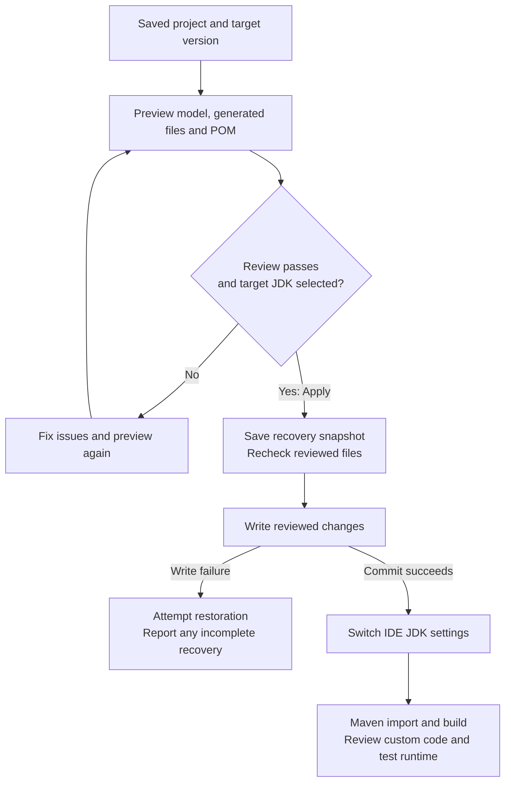
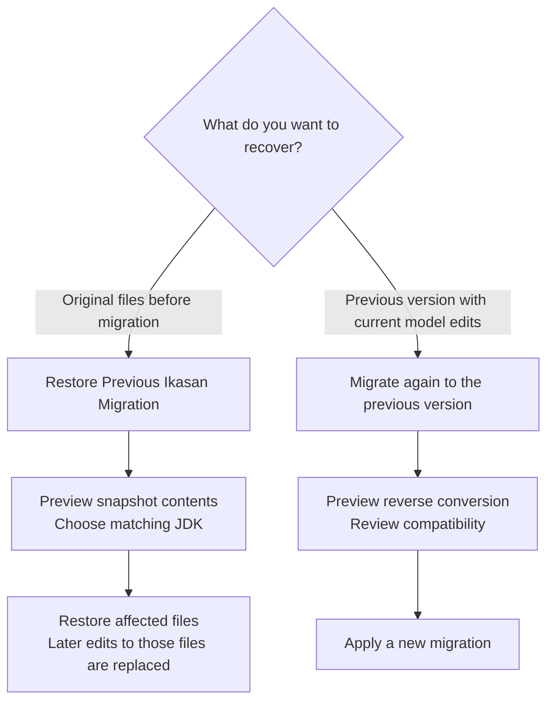

# Migrating Ikasan versions

Studio can migrate a saved project between **V3.3.9 and V4.1.6 in either direction**. Use **Tools → Ikasan Studio → Migrate Ikasan Version…** (also available through Find Action). You can also right-click the module in the designer and choose **Migrate Ikasan Version…**. Configured modules show their version as read-only in Properties.

## Workflow

1. Commit or back up the project and stop the running module. Save open project files and apply or discard pending Studio property edits. Wait for source generation and indexing to finish. The canvas must agree with the saved model.
2. Select the target version. Studio analyses an isolated copy of `model.json` and renders the proposed generated files and root Maven POM without writing them.
3. Review the migration report and the **File changes** tab. Unsupported components, missing required properties, incompatible choices, and structures that would lose data block Apply. Correct those issues in the source model and preview again. Select the target JDK in the review dialog: **Java 11 for V3.3.9** or **Java 17 for V4.1.6**. If none is listed, cancel, install/register the JDK in **File → Project Structure → SDKs**, then reopen migration. Preparing the JDK does not require changing the project SDK first. Apply is unavailable without a matching JDK.
4. Apply. Studio saves a recovery snapshot under `.ikasan-studio/migrations/`, checks that the reviewed files have not changed, and writes the reviewed contents. A write failure triggers restoration of previously written files. After the file commit, Studio switches the project SDK, Maven module SDKs, Maven importer/runner and existing Studio Application Run/Debug configurations to the selected JDK.
5. By default Studio requests Maven import and an IntelliJ build, reporting build success, errors or cancellation through a notification. Review developer-owned code for API changes. Run application tests and check runtime behaviour before deploying.

The conversion itself is offline. Maven import or compilation can need downloads when required dependencies are not already cached. Compilation failure does not undo the migration: use the errors to update your implementation, or restore the recovery snapshot.

### Migration at a glance

Preview does not write project files. Apply requires a valid review, a matching JDK and unchanged source files.



A compilation failure after the commit leaves the migration applied. Correct the application or restore its snapshot.

## What changes

- The model's selected version and supported component identities are mapped through explicit directional rules supplied with the target meta-pack.
- JMS, JAXB and resource exception type references move between `javax` and `jakarta` in recognised type fields. Resolver keys and caught exception types change together. Arbitrary descriptions and opaque extension values are not subjected to text replacement.
- Shared properties retain their values. Changed defaults are made explicit where a source value can be preserved; unsupported type/property changes require a separate rule or source-model correction.
- Studio regenerates its application, module configuration, flows, factories, generated property classes, properties, H2 POM and offline AI contract. The root POM adopts the target Ikasan BOM, dependencies and Java compiler settings. Unversioned dependencies contributed by source-pack components and no longer required by the target pack are removed when their declarations are otherwise unmodified (for example the old JAXB API/runtime). Explicit versions, customised declarations and unrelated dependencies are preserved; review their compatibility in the POM diff.
- Existing root `AGENTS.md` and files under `user/` are preserved. Migration does not rewrite custom implementations or regenerate existing user stubs. Review custom classes, injected beans, JMS/JAXB/resource imports and Debug support for target API compatibility.
- Opaque module, flow and component JSON fields survive loading and subsequent saving. If another model structure cannot survive Studio's round trip, migration is blocked.

A model conversion does not prove equivalent runtime behaviour. Unsupported version pairs and unrecognised component identities are blocked rather than guessed.

## Restore versus migrate back

**Tools → Ikasan Studio → Restore Previous Ikasan Migration…** previews restoration of the latest completed snapshot. It restores exact original file contents, removes files introduced by the migration, and leaves unrelated files alone. Team instructions added to `AGENTS.md` after migration are retained. Review carefully: subsequent edits to the affected generated files and root POM are replaced. A new snapshot preserves the state before restoration, so the restoration itself can be reversed. All snapshots remain in the history directory. IDE SDK settings are not stored in these file snapshots; the restore review asks for a JDK matching the restored version and applies it using the same process.

To keep new flows and other subsequent model edits while returning to the previous Ikasan version, use **Migrate…** again and choose that version. This runs reverse conversion rules against the current model; it does not restore an old copy.

Snapshots use versioned JSON containing the report and Base64-encoded original/proposed file bytes. A `committed: false` snapshot records an interrupted or failed operation and is not selected automatically as a completed migration. If automatic recovery is reported incomplete, inspect that snapshot and the IDE log before reloading or saving the model.

### Choosing a way back

These are different operations: restoration recovers saved file contents, while reverse migration converts the current design.



Neither route restores external databases or delivered messages.

## Maintenance and verification

The framework-independent engine is in `core/migration`. `MigrationController` owns IntelliJ progress, review, reload and build integration. Project-scoped guards exclude concurrent Studio generation; filesystem preconditions reject external edits after preview. File IO and template rendering run outside the EDT. The preview uses IntelliJ's native diff viewer.

Directional rules live at:

- `studio/metapack/V4.1.6/migrations/from-V3.3.9.json`
- `studio/metapack/V3.3.9/migrations/from-V4.1.6.json`

Adding another supported path requires reviewed component mappings, any necessary property/type conversion logic, target API validation and tests in both directions. Do not infer downgrade support simply by reversing an upgrade rule that discards information.

Run `./gradlew test validateMetaPacks --no-configuration-cache`. Migration tests cover both versions, routed flows, exception identities, opaque JSON, ownership, stale previews, rollback and snapshot restoration. They also emit representative projects for real compiler checks:

```sh
mvn -B -f build/migration-compile/V4.1.6/pom.xml -DskipTests compile
mvn -B -f build/migration-compile/V3.3.9/pom.xml -DskipTests compile
```

Before release, exercise the dialog in light and dark themes: cancel a preview, apply each direction, inspect build results, restore a snapshot, and repeat with custom code and unsaved edits. Check that deliberate editor closure and other open projects remain unaffected.

## Reusable runtime migration fixture

The [migration regression module](../regression-tests/migration/README.md) supplies
an importable model, complete developer-owned implementations, 12 compact flows and
isolated FTP/SFTP/SMTP services. Its acceptance suite exercises every bundled executable
component type, both routers and persisted exception exclusion, then checks idle readiness
and later delivery. It produces Markdown/JSON reports and compares user-source hashes
and model structure before and after migration.

Use the same generated workspace for the interactive upgrade; retain the before report
and run the unchanged tests after generation. The headless fixture builder also supports
an engine-driven target build, but it does not replace migration-dialog and recovery UX
checks. See the fixture's coverage notes for visual-only entries and shutdown limits.

## Verify your own project or migrate without IntelliJ

The [command-line migration and verification tools](CommandLineMigration.md) run your
project's Maven tests before and after an upgrade and compare model/source preservation.
They are independent of the all-components fixture. A standalone Java 17 utility also
provides saved migration previews and explicit apply with recovery snapshots, using the
same engine as Studio. Close the project in IntelliJ before applying CLI changes.

### Reusable flow tests

**Tools → Ikasan Studio → Generate Flow Test…** creates developer-owned tests in a separate
`user-flow-tests` module. Complete the scenarios before migration and run them again afterwards.
Their Ikasan framework dependency inherits `version.ikasan`; migration preserves the source
and module entry. See [flow testing](IkasanFlowTesting.md) for setup and limitations.

### Generated verification baseline

For automatic structural checks, use **Generate/Refresh Verification Tests…** from Tools →
Ikasan Studio or the module context menu before migration. This creates `generated-verification`;
it complements the business scenarios in `user-flow-tests`.

1. Generate and commit the baseline with the original application. Run
   `mvn -pl generated-verification -am test` from the project root, plus your business tests.
2. Save `generated-verification/target/surefire-reports` outside `target/` as before evidence.
3. Migrate the application using the workflow above. Leave both sets of test sources unchanged.
4. Run the same tests with the target JDK, save the after reports separately, and compare
   passed, failed and skipped checks. Investigate any compilation or contract failures.
5. After reviewing the comparison, optionally refresh the generated verification tests to
   establish the next baseline. Studio archives the previous directory before replacing it.

`BASELINE_MODEL_SHA256` in `GeneratedVerificationSupport` identifies the saved model at test
generation, not the Java sources. A model-hash warning is expected following migration; it
does not change the assertions or mean they failed. These tests currently check signatures
and interfaces only; runtime behaviour is explicitly skipped. Passing them does not prove
delivery or business equivalence.

If an interface change prevents the original tests compiling or running, preserve that failure
evidence before adapting or refreshing them. Record the changed expectations: results from
changed tests do not constitute an unchanged before/after comparison. See
[generated verification](GeneratedVerification.md) for coverage and ownership details.
