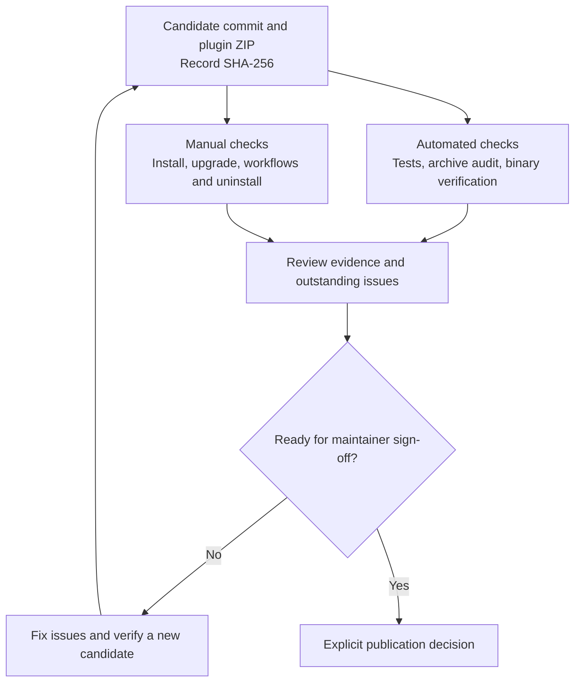

# Release-candidate verification

Do not equate a successful build or Plugin Verifier result with an installation or project-workflow test. Keep the candidate ZIP, its SHA-256, reports, IDE builds, runtimes and manual results together.

## Evidence for a release decision

Automated and manual checks provide complementary evidence for the same candidate. Keep the archive hash with the results so a later rebuild is not mistaken for the tested artifact.



This is the verification process, not an automatic publication pipeline. A successful verifier result alone is insufficient for sign-off.

## Repeatable automated gates

```bash
./gradlew -p headless cleanTest test
./gradlew cleanTest test buildPlugin verifyReleaseArchive verifyPlugin
```

The standalone build tests the engine and packaged component libraries with the Java 17 toolchain. The plugin test task uses IntelliJ's configured test runtime. The supported IDEs require their bundled JetBrains Runtime; Java 17 is the compilation/headless-engine requirement, not a replacement IDE runtime.

`verifyReleaseArchive` inspects the actual ZIP and nested JARs. It compares every runtime resource with the source tree, including each supported pack's templates and icons, checks the plugin metadata and dependency declarations, checks Studio class-file compatibility with Java 17, rejects bundled test frameworks, and verifies inclusion of `LICENSE.txt`. Root-level meta-pack authoring documents are not runtime resources. The report inventories embedded third-party licence/notice entries; review dependencies without embedded notices before publication, including the separately supplied Ikasan libraries.

Reports:

- `build/reports/tests/test/` and `headless/*/build/reports/tests/test/`
- `build/reports/release/archive.json`, including candidate SHA-256 and library inventory
- `build/reports/pluginVerifier/`, with a separate verdict for every IDE

CI runs the archive audit during the Build job. The verifier checks these explicit boundaries, configured in `gradle.properties`:

| Role | IDE |
| --- | --- |
| Oldest declared release (build 242) | IDEA Community 2024.2 |
| Compilation target | IDEA Community 2024.3.7 |
| Newest pinned stable release | Unified IDEA 2026.2.2 (IU distribution) |

Before each candidate, check JetBrains' stable releases and update `verificationNewestIde`. An absent `until-build` is not evidence of future compatibility. Keep the oldest target aligned with `pluginSinceBuild`. Do not suppress verifier failures just to pass the gate. Ordinary deprecations must be recorded and scheduled for maintenance; internal API and binary compatibility failures block the automated gate.

References: [Plugin Verifier configuration](https://plugins.jetbrains.com/docs/intellij/tools-intellij-platform-gradle-plugin-extension.html#verify-plugin), [IDEA 2026.2.2 announcement](https://blog.jetbrains.com/idea/2026/09/intellij-idea-2026-2-2/).

## Isolated startup smoke test

Use a new directory for every clean-profile run; never point this at the developer's normal IDE profile.

```bash
./gradlew buildSearchableOptions --rerun -PstudioSandboxDirectory=/tmp/ikasan-studio-rc-new-profile
```

This starts the target IDE headlessly, loads the plugin and traverses its settings UI. Verify the log records `Loaded custom plugins: IkasanStudio`, the expected runtime, and no Studio-attributed errors. The log is below `<sandbox>/ikasanstudio/IC-2024.3.7/log/idea.log`. This is a startup/settings check only.

For interactive project checks with a separate sandbox:

```bash
./gradlew runIdeInternal -PstudioSandboxDirectory=/tmp/ikasan-studio-rc-interactive
```

## Manual installation and workflow evidence still required

For both release boundaries, use an isolated user profile and record OS, IDE build, JBR, candidate hash, previous version/hash for upgrade, tester and result. Exercise the real Plugins UI; copying files into a sandbox is not evidence that Install from Disk, Upgrade or Uninstall works.

1. **Clean installation:** start without Studio, install the candidate ZIP from disk, restart if requested, check Settings and Tools actions, then create/open an Ikasan project and reach a usable Studio canvas.
2. **Upgrade:** install the previous candidate/released ZIP first, configure projects and settings, then install the new candidate. Verify models, user source, settings and deliberate editor-tab closure survive. Use distinct recorded versions; reinstalling the same ZIP does not test upgrade.
3. **Every pack:** open the item 2 golden projects for each manifest present in the archive report (currently V3.3.9 and V4.1.6). Allow Maven import/indexing to finish. Exercise property confirmation, generation, Run/Debug, Blue Console, routers and the relevant harnesses. Record generated-project JDK requirements from each pack rather than assuming every generated application uses Java 17.
4. **Uninstall:** stop owned executions/harnesses, uninstall through Plugins and restart if requested. Confirm actions/settings are gone, user projects and implementation files remain, and no Studio-owned processes remain. Reinstall and reopen the saved projects.
5. **Clean machine/profile:** repeat without existing Studio settings or plugin state. Record whether Maven caches and external tools were also clean; a fresh IDE profile does not imply an empty Maven cache.

Run the threading, multi-project and harness checks in [MarketplaceReleaseManualChecklist.md](MarketplaceReleaseManualChecklist.md) as well. Attach the item 2 suite's results from its actual branch/checkout; do not infer those results from unit or packaging tests.
