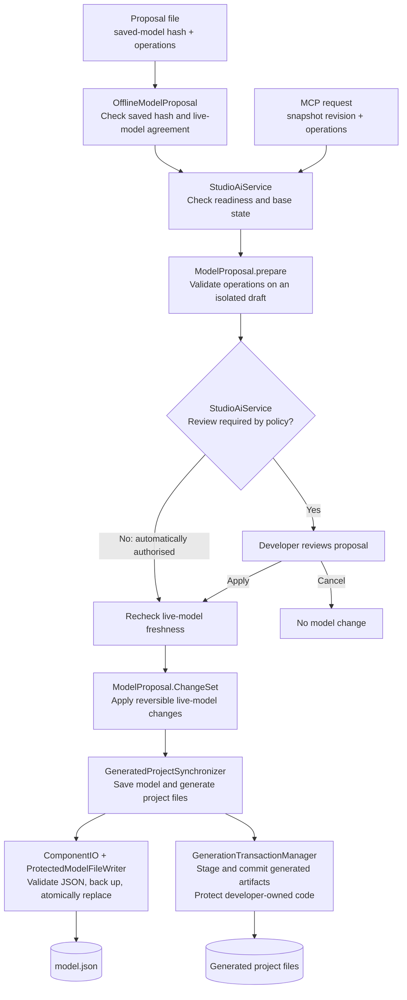

# AI proposals against the live Studio model

Studio can expose the open project's in-memory model to an MCP client. The client reads a snapshot and the selected meta-pack's catalogue, then submits operations for validation and application. It does not edit `model.json` or apply changes itself.

## At a glance

The agent proposes changes to the live model. Validated supported changes can apply automatically when Always ask for approval is off (the default), subject to Confirm deletes (on by default). Potential developer-owned code replacement always requires review and Apply. Studio validates, saves and generates files in both cases.

See the [AI support overview](AiSupportOverview.md) for architecture and proposal data-flow diagrams.

IntelliJ and the agent stay running throughout. The agent checks the proposal status to learn whether review or generation is still pending, completed, or failed.

## Validation, approval and persistence layers

The **model proposal validation and application layer** sits between AI request handling
and the live Studio model. The AI sends named operations, not a replacement `model.json`.
MCP requests and imported proposal files converge on the same validation and application
path. The visual editor shares the live model and persistence pipeline; manual edits do
not pass through the AI proposal approval policy.

This data-flow diagram shows responsibilities within Studio, not separate services:



Failed readiness, base-state or proposal checks stop the request before applying its
changes. The diagram's two output paths are **not one atomic transaction** across the
live model, `model.json` and all generated files.

| Layer | Responsibility and implementation |
| --- | --- |
| Request handling | MCP adapters/toolsets and `StudioAiService` expose project-scoped operations. `OfflineModelProposal` checks the file proposal's saved-model hash and agreement with the live design. |
| Proposal validation | [`ModelProposal`](../headless/studio-generator/src/main/java/org/ikasan/studio/core/ai/ModelProposal.java) builds an isolated draft and checks supported operations, names, component/property metadata and route constraints before preparing reversible edits. |
| Approval and freshness | [`StudioAiService`](../src/main/java/org/ikasan/studio/intellij/ai/StudioAiService.java) selects automatic application or review. It rechecks the original live snapshot before application and blocks changes while Studio is unready, property edits are pending, migration is active or generation is unfinished. |
| Live-model application | `ModelProposal.ChangeSet` updates the existing objects; `StudioAiService` integrates the changes with IntelliJ Undo/Redo and refreshes the designer. The saved JSON is a representation of this model. |
| Persistence | `GeneratedProjectSynchronizer` serializes the model. `ComponentIO` validates persisted JSON through model deserialization. [`ProtectedModelFileWriter`](../headless/studio-generator/src/main/java/org/ikasan/studio/core/persistence/json/ProtectedModelFileWriter.java) validates the candidate, existing file and temporary content, rotates backups and uses atomic replacement. |
| Generated-file protection | [`GenerationTransactionManager`](../src/main/java/org/ikasan/studio/intellij/project/GenerationTransactionManager.java) stages output and checks conflicts and authorisation for replacement of developer-owned files. Model approval does not silently grant unrestricted replacement of `user/` code. |

**Approved does not always mean a dialog.** A valid proposal is automatically authorised
when the configured policy permits it. **Always ask for approval** defaults to off;
**Confirm deletes** defaults to on for flow/component deletion and component replacement.
Potential developer-code replacement requires review regardless of those preferences.
Validation and freshness checks apply in both modes.

**Limits and failure handling.** Structural validity is not proof of a working integration.
Empty flows can be valid incremental designs; compilation and runtime tests still establish
API compatibility, bean availability, delivery and recovery behaviour. The published JSON
schema helps clients understand the format; enforcement also depends on operation checks,
meta-pack rules and deserialization, not the schema alone.

A generation failure is reported as `generation_failed`; the updated model may remain for
repair or Undo rather than all changes being rolled back. Model Undo does not encompass
separate AI edits to custom Java. Atomic replacement protects the model file itself and
fails without replacing it if the filesystem cannot support that operation.

These are application-level safeguards, **not a filesystem security boundary**. An external
tool with write access can bypass Studio and edit `model.json` directly. Generated agent
instructions direct assistants through proposals and prohibit direct edits while Studio is
open; instructions do not enforce operating-system permissions.

## Connect

1. Choose **Connect AI to Ikasan Studio** on the module-creation page, or select **Tools → Connect AI to Ikasan Studio…** at any time (also in Find Action).
2. On supported IDEs (2026.2 onward with the bundled MCP Server plugin), use the **IntelliJ MCP (recommended)** tab. Open MCP settings and check **Enable MCP Server**; this reveals the client configuration controls. For everyday use across projects, find your client under **Clients Auto-Configuration** (recommended). This reuses the client connection setup across projects. Choose **Project Clients Auto-Configuration** instead for setup specific to this project, or if your client is listed only there. Open the **Auto-Configure** dropdown and select **Configure with Streamable HTTP transport** if offered; otherwise, use the available Auto-Configure option. General client configuration does not enable Studio access automatically in every project: use **Connect AI to Ikasan Studio** in each project. A different IDE installation or changed server address may require reconfiguring the client. Click **Apply** or **OK**. In IntelliJ AI chat, click **+ New Chat** and select **Codex**. Paste the Studio test prompt into that new chat; this sequence was confirmed with the IntelliJ 2026.2.2 Codex integration. Other clients may need their own reconnect action. Specify the project when several projects are open.
3. Otherwise, use **Manual setup**, copy the configuration and merge its server entry into your AI client's MCP settings. The bundled Java adapter uses the IDE runtime; no Python, separate JDK or `JAVA_HOME` setup is needed for a client on the same machine.
4. Open and configure Studio, finishing any pending property edits and generation. Select **Copy test prompt** and paste it into your AI chat. The connection checklist shows whether Studio access is enabled, the model is ready, the selected route has tools available, and a client has successfully read the model or catalogue. Opening MCP settings alone does not verify the connection. A successful read records the last client check; it does not continuously monitor the client connection.
5. Ask for changes. Studio applies validated proposals automatically when policy permits; when review is required, select **Apply** or **Cancel**. Check the final proposal status.

Closing the connection dialog keeps access enabled. **Enable AI access automatically when this project reopens** is selected by default when you first use Connect AI. You can clear it to disable automatic access. **Stop bridge** disables access and automatic reconnection. Closing this project stops the bridge; reopening restores it when automatic access is enabled. Without that option, use Connect AI again. Tools report an actionable error until Studio is ready.

Manual configuration paths are stable for this project and IDE configuration directory, so the same client entry can be reused across bridge restarts. Session tokens rotate at every start. Moving the project or changing the IDE installation/runtime may require copying the configuration again. Two IDE sessions using the same configuration directory cannot own the same project's connection simultaneously. The executable, adapter and connection paths belong to the IDE host; containers, WSL and remote clients need a separately arranged connection.

The adapter uses [MCP stdio](https://modelcontextprotocol.io/specification/2025-03-26/basic/transports). Its private HTTP connection is bound to `127.0.0.1`, requires a random bearer token, rejects browser Origin headers, and is not a public Streamable HTTP MCP endpoint. Connection files live in IntelliJ's configuration directory, outside the project; on POSIX systems the directory and token file are owner-only. Do not share the connection file. No AI account, model provider or cloud service is bundled. Known password, secret, token and credential fields are redacted from snapshots; other model content is visible to the connected client, including text properties that might themselves contain sensitive data.

## Tools

| Tool | Result |
| --- | --- |
| `studio_snapshot` | Live model, project name and opaque revision. No disk reload. |
| `studio_catalogue` | Component keys, property types/defaults/choices and payload contracts for the selected meta-pack. |
| `studio_propose` | Validates operations on an isolated model, then applies or requests review according to policy. Returns a proposal ID and summary. |
| `studio_proposal_status` | `awaiting_review`, `cancelled`, `generating`, `applied`, `generation_failed`, or `undone`. |

Snapshots are bounded to the last eight reads and statuses to the last sixteen proposals. Only one review can be pending per project. A proposal is checked again immediately before Apply. Manual edits, model reloads, version migration and pending property edits prevent a stale proposal from being applied. Obtain a fresh snapshot and propose again.

## Operation contract

Submit `{"revision":"<from studio_snapshot>","operations":[...]}` to `studio_propose`. Operations execute in array order on a detached candidate. Up to 100 operations are accepted.

- `deleteFlow`: `type`, `flow` (existing flow name). Removes the entire flow and attached test harnesses, retaining developer-owned source files.
- `addFlow`: `type`, `flow` (new flow name).
- `addComponent`: `type`, `flow`, `key` (exact catalogue key), `name`, optional `properties` object and `route` path (an array of branch names, omitted for root). A consumer occupies the flow's consumer slot; other components are inserted before its terminal producer. Required properties with metadata defaults are materialised as in Studio.
- `setProperty`: `type`, `flow`, `component` (existing name), `property`, `value` (scalar or null). Protected user-supplied bean references, such as `endpointEventProvider`, can point to an existing implementation (for example `MinuteEventProvider`). The normal approval policy applies. It does not create or verify the Java implementation; source overwrite must be off. Properties that regenerate implementation code still require editing in Studio.
- `connect`: `type`, `flow`, optional `route` path and `order` (every executable component in that route exactly once; include the consumer first only for root). Studio derives transitions. Associated endpoint decorations are omitted.

For example, with an FTP-capable selected meta-pack:

```json
{
  "revision": "<revision returned by studio_snapshot>",
  "operations": [
    {"type": "addFlow", "flow": "Transfer"},
    {"type": "addComponent", "flow": "Transfer", "key": "FTP Consumer", "name": "ReadFiles",
     "properties": {"cronExpression": "0/5 * * * * ?", "sourceDirectory": "/incoming"}},
    {"type": "addComponent", "flow": "Transfer", "key": "FTP Producer", "name": "WriteFiles",
     "properties": {"outputDirectory": "/outgoing"}},
    {"type": "connect", "flow": "Transfer", "order": ["ReadFiles", "WriteFiles"]}
  ]
}
```

Read the catalogue for required host, port and credential settings; the example uses metadata defaults where available. Empty flows and incremental flow construction are supported; incomplete flows show review warnings and must be completed before running. Unsupported components/properties, duplicate names, missing required values, invalid property types/choices and known payload mismatches reject the whole proposal. Payload checking uses Studio's design-time metadata and is not a substitute for compiling and testing the generated application.

The API supports linear and branched route trees, router configuration and flow-wide exception rules. Shared downstream merges, flow renaming, implementation regeneration and version migration remain outside the proposal API. Unrelated flows and their object identities are preserved. No operation grants permission to overwrite developer-owned code.

## Apply, generation and undo

Apply updates the live model, refreshes the canvas/properties, and uses Studio's normal protected model persistence and generation pipeline. The model proposal has one global IntelliJ undo entry; Undo and Redo regenerate the corresponding output. A failed immediate save rolls back the model. An asynchronous generation failure is reported by Studio and as `generation_failed`: the model remains applied so the developer can fix the problem and regenerate or undo it.

For external model edits, follow the project AGENTS.md guidance on overwrite protection and a verified reload mechanism. Closing and reopening the editor tab alone does not guarantee a reload. Keep IntelliJ and the agent running; use the live bridge for changes to an open Studio session.

## Proposal files without MCP

Use **Tools → Import AI Proposal into Ikasan Studio…** to review a JSON proposal without starting the bridge. The connection dialog also has a **Proposal file (no MCP)** tab. Agents read `generated/IKASAN_STUDIO.md` for the versioned file format and examples. A proposal contains `formatVersion: 1`, `baseModelSha256` (SHA-256 of the exact saved `generated/src/main/model/model.json` bytes), and the usual `operations` array. Store it outside `generated/`, for example under `ai-proposals/`.

Import checks the saved model digest and its agreement with the live design. Validation and review do not modify the model. Apply uses the existing undoable model change and generation pipeline; the developer returns to the AI chat after completion. Regenerate an existing project through Studio to refresh its generated agent guide after installing this feature.

`renameComponent` accepts `flow`, `component` (old name), and `name` (new name). It supports consumers and body components in root and branch routes, preserves component identity for Undo, and updates serialized transitions. It does not rename Java implementation classes or flow names.

### Automatic proposal discovery

Without MCP, agents write a uniquely named `*.studio-proposal.json` directly into the project's `ai-proposals/` folder. Write a temporary file first and rename it into place once complete. Studio checks that folder in the background every three seconds and waits for stable file metadata before processing the proposal. Validated changes may apply automatically; deletion/replacement confirmation, user-code overwrite risks or the approval preference require review. No review dialog opens automatically from background discovery; proposals needing attention appear in the banner. **Tools → Review Latest AI Proposal** opens the most recently modified proposal without a chooser. Existing files are not announced again on IDE startup. The import action still accepts other files. All file-import routes retain saved-model hash, live-model and operation checks; explicit Apply is required when the approval policy calls for review. The inbox is project-scoped and its monitoring stops when the project closes.

The Studio editor also shows a persistent proposal banner with **Review changes** and **Dismiss**. The pending filename is saved in project workspace state, so closing the editor or restarting IntelliJ preserves the banner. Opening a review successfully or explicitly dismissing it clears the banner; load/validation errors leave it available for retry. Dismiss does not delete the proposal file. A newer proposal replaces the banner's pending proposal; the import action can still open older files.

`addFlow` also accepts an empty flow as a design placeholder, matching Studio’s manual Add flow action. Review and Apply work through MCP and proposal files. The generated scaffold is incomplete until a consumer and producer are added; the review summary identifies this. Components can be added in separate proposals. Incomplete flows produce review warnings, while required-property and ordering validation still applies.

### Automatic application

Settings → Tools → Ikasan Studio → **Always ask for approval** defaults to off. All validated supported operations can skip review: adding flows/components, editing properties, renaming components and connecting components within routes. Full generation is checked for developer-owned code overwrite flags in both the live and proposed models, including unaffected flows. Any such risk requires explicit review, even when the preference is off. The generation transaction also refuses unauthorised replacement of existing files under `user/`. Component deletion removes model entries only and retains developer-owned source files. The same policy applies to MCP, manual imports and new proposal files detected in `ai-proposals/`. Validation, stale-state checks, code generation and Undo remain in place. A completion notification identifies automatically applied changes. Failed automatic file imports retain a review banner. Agents must inspect MCP status (or reread the saved model for file proposals) before claiming success.

### Edit flow properties and startup behaviour

`setFlowProperty {type, flow, property, value}` edits a metadata-defined scalar flow property.
Normal ESB flows should start automatically. For example, when restoring automatic startup
for a flow that the developer wants enabled:

```json
{"type":"setFlowProperty","flow":"Receive Files","property":"flowStartupType","value":"AUTOMATIC"}
```

Choices and property types are validated against the selected pack. Null clears an optional
value. Names, structural/internal fields and implementation properties are excluded. The
operation follows the same approval, freshness, persistence and Undo/Redo path as component
edits. Generated per-flow startup entries leave the module default unchanged. Persisted
runtime startup controls can take precedence; inspect effective settings and use supported
operator controls rather than forcing database overwrite. Preserve existing operator choices.

Missing external services or configuration are blockers to resolve, not reasons for the AI to
set flows to MANUAL or DISABLED. Keep startup failures visible and report incomplete acceptance
checks. Only disable a flow when explicitly requested by the developer. Bounded test isolation
must not change the saved startup policy or replace verification of the normal launch path.

**DEMO ACCEPTANCE RULE: DO NOT LEAVE DEMO FLOWS STOPPED.** While the module is running,
every requested normal demo flow must run and remain ready for later input. A stopped flow does
no work. Quietly disabling it hides missing setup and makes developers waste time finding why
nothing happens; a visible startup error exposes the problem. Do not call the demo complete
while any required flow is stopped or in error, even if that state is explained in a README.
Resolve the cause or report the demo as BLOCKED/INCOMPLETE with the exact remaining action.

ESB flows, including demonstrations, must remain running and available after sample delivery.
Generated guidance requires an idle/readiness check and another batch in the same running
application without resetting beans or restarting flows. Finite completion is reserved for
explicit batch requirements or bounded tests; completion messages do not excuse an unintended
Stopped state. Verify Studio's normal **Run module** path separately. A launcher that starts selected flows with overrides is
useful test evidence but does not establish normal-launch readiness. See the
[untitled11 review](AiDemoReview-2026-09-20-untitled11.md) for the motivating findings.

### Delete or replace a component

`deleteComponent {type, flow, component}` removes a component from its route. `replaceComponent {type, flow, component, key, name, properties?}` changes its type and configuration while retaining its position. Consumers can only be replaced with consumers; body components with body components. Defaults come from the new type, with explicit properties overriding them. Both operations retain developer-owned source files, support Undo/Redo and follow the automatic application preference and overwrite-risk checks. Remove branch contents before deleting or replacing a router. Deleting entire flows, including branched flows, is supported.

For example, replace a consumer and preserve its downstream connection:
```json
{"type":"replaceComponent","flow":"toby","component":"bob","key":"Spring JMS Consumer",
 "name":"Receive from Tom","properties":{"destinationJndiName":"tom.to.toby"}}
```

### Guidance for completing implementations

The catalogue exported by `studio_catalogue` and generated into `component-catalogue.json` includes component/property help, documentation references, implementation and overwrite flags, supported proposal operations, and recipe configuration examples derived from the selected meta-pack. The generated guide distinguishes diagram creation from runnable functionality, explains File/List<File> and JMS type-check examples, and requires inspection of generated scaffolds, relevant tests and a clear report of runtime prerequisites and unfinished work. Completing a new, unmodified stub within the user's requested task is distinguished from replacing existing developer logic. Existing application guides refresh through normal Studio generation; regeneration does not modify existing developer implementations automatically. Router and resolver proposal operations are described below.

**Confirm deletes**, in the AI assistance settings group, defaults to on and requires review for flow deletion, component deletion and component replacement through either MCP or imported proposals. Disabling it permits automatic application unless Always ask for approval or developer-code protection requires review. Whole-flow deletion supports branched flows, removes attached test harnesses, retains developer-owned source files, and supports Undo/Redo.

### Defaults, transport links and failure recovery

The catalogue distinguishes literal `default` values from internal `defaultExpression` rules and exposes `setPropertySupported`, `editGuidance` and `endpointKey`. Agents should omit derived defaults on creation or supply concrete values. Proposal creation resolves `__fieldName:` defaults without opening Properties. An existing unresolved `userImplementedClassName` can be repaired with `setProperty`; valid implementation names retain the existing protection against implementation-sensitive edits.

The generated guide now explains cross-flow JMS/FTP/SFTP matching, flow insertion order, and the difference between inferred canvas links and tested delivery. SFTP canvas connectors and proposal flow reordering are not currently supported. Generation failure must stop dependent work and trigger a focused repair against the updated model, not blind retries or a claim that compiling the previous skeleton validates the new flows.

New names introduced by `addFlow`, `addComponent`, `replaceComponent` and `renameComponent` must match `[A-Za-z][A-Za-z0-9_ ]{0,79}`. Use `Flow01` or `Demo01` for numbered flows, not a leading digit. References to existing flows/components retain their exact saved names. Validation errors identify the rejected new name.

### Functional completion

Functional flow, integration and demonstration requests default to working behavior. Explicit diagram-only requests remain supported. Agents should state reasonable sample assumptions, finish unblocked custom implementations and focused tests, and identify external setup separately. Existing developer code protection continues to apply. Compilation, behavior tests and verified runtime delivery are separate outcomes.

Catalogue `completionChecks` provide role-specific implementation and verification obligations. User-supplied-class properties expose `beanRequirement`: agents must locate the implementation/provider, Spring registration, injection type/name and scan configuration. Model references are not evidence of a registered bean. Missing custom implementations may be created in `user/` within the requested scope; external `noStubRequired` references require a real configured provider, not an invented stub.

The generated guide also specifies staged runtime verification: compilation, component tests, startup using the actual generated application configuration, and end-to-end delivery through sender and receiver flows. Isolated transport tests and user-bean scanning do not establish that generated flow wiring works. Agents should exercise available local paths within the authorised task, record repeatable commands and observed outputs, use bounded waits, and report external service blockers separately. Temporary configuration changes must use supported test configuration or Studio proposals; generated files and the open model remain protected. Coverage reports must distinguish executable components, exception policies, containers and endpoint decorations, and state any unfinished implementations.

File-output guidance now requires checking publication and retry behaviour: partially written files must not appear as completed output, and duplicate filenames alone do not establish crash recovery. Agents should verify transport-specific staging semantics and preserve existing files on conflicts. Shutdown is a separate verification result: owned workers/resources should terminate, with stop/start checks where relevant. A forced process exit must not be reported as clean shutdown, and failed cleanup must remain visible in verification results and exit status. These are generated guidance improvements; they do not automatically change implementations in existing projects.


## Routing and exception policies

Both MCP and proposal files support these operations:

- `configureRoutes {type, flow, component, names}` configures a router's branch names (2–32 names, starting with a letter and containing letters/digits). Add the router with `addComponent` first. Empty default branches can be renamed/replaced; populated branches must retain their names.
- `addComponent` and `connect` accept `route: ["Accepted"]`, or a nested path such as `["Accepted", "Audit"]`. A router is terminal in its parent route. Each branch should end in a producer or another router. Components are named uniquely across the flow.
- `setExceptionResolution {type, flow, exception, action, properties?}` adds or updates the rule for one fully qualified exception class, preserving other rules. The `.class` suffix is optional. The catalogue's `exceptionActions` lists supported names, required properties and defaults. These are flow-wide policies, not connected processors.

Example operations, after creating a flow named `Orders` and its consumer:

```json
[
  {"type":"addComponent","flow":"Orders","key":"Single Recipient Router","name":"ChooseDestination"},
  {"type":"configureRoutes","flow":"Orders","component":"ChooseDestination","names":["Accepted","Rejected"]},
  {"type":"addComponent","flow":"Orders","route":["Accepted"],"key":"Logging Producer","name":"LogAccepted"},
  {"type":"addComponent","flow":"Orders","route":["Rejected"],"key":"Dev Null Producer","name":"DiscardRejected"},
  {"type":"setExceptionResolution","flow":"Orders","exception":"org.ikasan.spec.component.transformation.TransformationException","action":"excludeEvent"}
]
```

Choose router input types compatible with the upstream payload. Implement the generated router class:
a single-recipient router returns one configured name; a multi-recipient router returns a list.
Test every branch, fallback and fan-out, including shared mutable payload behaviour. Configuring names
does not update existing custom routing logic automatically.

Choose exception policies explicitly. Avoid silently ignoring failures or retrying indefinitely.
In the bundled packs, retry `delay` is milliseconds; the legacy `interval` parameter means maximum
retry count. Class-name syntax, action names and action properties are checked, but compilation and
runtime tests must establish exception availability/type, actual matching and recovery behaviour.
Cron validation is structural, not proof that the schedule behaves as intended.

For a demonstration prompt, ask for a single-recipient router with `Accepted`/`Rejected` branches,
a multi-recipient router sending accepted orders to both `Audit` and `Fulfilment`, and a separate
invalid-order example that throws `TransformationException` and uses `excludeEvent`. Request tests
that prove every route receives the intended values, the invalid event is excluded and a subsequent
valid event is processed. Ask the agent to report any external setup or unsupported work explicitly.

## File proposal results and recovery

For a file imported manually or checked by the inbox watcher, Studio writes an adjacent
`<proposal-filename>.result.json` (for example `change.studio-proposal.json.result.json`).
The result is not a proposal and is ignored by the inbox. It contains `formatVersion`,
`proposalFile`, `proposalSha256`, `updatedAt`, `status`, `message` and `nextStep`.
Check the proposal hash before using feedback; changing the submitted file invalidates its
old receipt. Writes run off the EDT and replace the result atomically where supported.

Statuses distinguish `awaiting_review`, `generating`, `applied`, `rejected`,
`generation_failed`, `cancelled` and `undone`. Applied means model application and generation
completed, not that compilation or runtime checks passed. A generation failure can leave model
changes in place: reread the current model and inspect generation diagnostics before retrying.
Awaiting review can precede validation when Always ask for approval is enabled.

Rejection dialogs offer **Copy feedback for AI**. Operation validation reports the operation
number and flow, with component/property details where available. Validation still stops at
its first error; it does not apply a valid subset of a rejected proposal. Generated AGENTS.md
and IKASAN_STUDIO.md instruct agents to read receipts, refresh their model/hash when correcting
a proposal, try at most two corrections, and then explain the blocker and manual Studio path.
Cancellation and undo must not trigger automatic resubmission. An idle chat does not resume
itself when a receipt changes: the developer may still need to ask the agent to continue.

Existing developer-owned AGENTS.md files are preserved. Existing projects can consult this
workflow through their regenerated IKASAN_STUDIO.md; add the receipt instruction to an older
AGENTS.md if necessary. A missing result is not success: use Review Latest AI Proposal or copy
the dialog feedback. Result write failures are recorded in the IDE log. Receipts contain error
messages and should be treated as project diagnostics rather than published automatically.

## Implementation readiness

Right-click the module and choose **Check Implementation Readiness...**. The advisory dialog
lists affected flows/components, finding codes and source locations; select a finding to open
its source. Save edits and use **Check again** to refresh. No user source is modified.

The first check covers primary user implementation files referenced by the model. It reports
missing source, the known generated converter exception (`Conversion has not been implemented`),
and selected generated implementation TODO markers. TODO findings require human/agent review:
comments can remain after implementation. An intentional UnsupportedOperationException with
another message is not automatically treated as an unfinished generated converter.

After successful generation Studio asynchronously publishes `generated/implementation-readiness.json`.
`studio_snapshot` includes fresh `implementationReadiness` findings against the live model and saved
source. Applied file-proposal receipts also include a fresh report. Inspect `checkedAt`; regenerate
or run the menu check after changing source. Unsaved edits, helper/provider beans, arbitrary no-op
implementations and runtime behaviour are outside this initial check. An empty report is not a
success certificate: `runtimeVerified` remains false. No compiler, tests or application are launched.

Before reporting a task complete, the AI must exercise actual component implementations and
verify delivery along each requested route, including exclusion/error behaviour. Compilation,
Spring registration, helper-only tests and a Running flow state are insufficient. Keep missing
implementations and unverified paths visible; do not remove TODO markers merely to clear findings.
