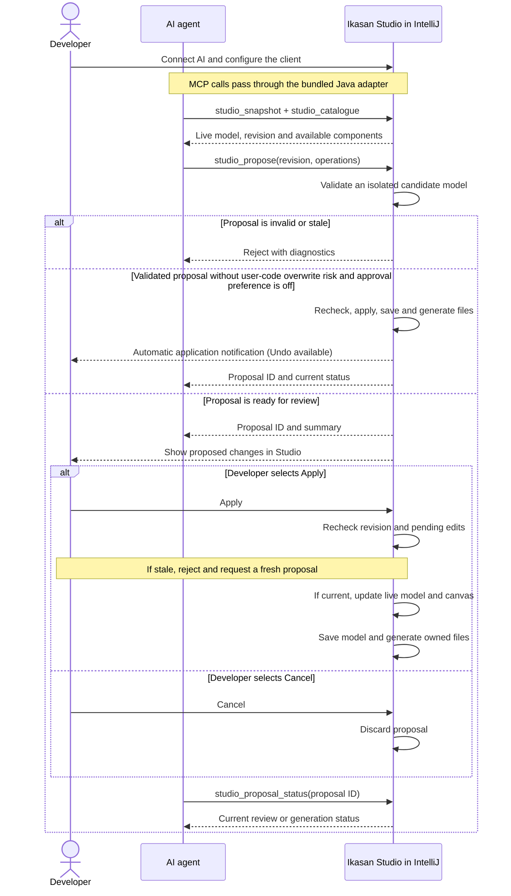

# AI proposals against the live Studio model

Studio can expose the open project's in-memory model to an MCP client. The client reads a
snapshot and the selected meta-pack's catalogue, then submits operations for review. It does
not edit `model.json` or apply changes itself.

## At a glance

The agent proposes changes to the live model. Validated supported changes can apply automatically
when Always ask for approval is off (the default), subject to Confirm deletes (on by default). Potential developer-owned code replacement always requires review and Apply.
Studio validates, saves and generates files in both cases.



IntelliJ and the agent stay running throughout. The agent checks the proposal status to learn
whether review or generation is still pending, completed, or failed.

## Connect

1. Open your project and select **Tools → Connect AI to Ikasan Studio…** (also in Find Action).
2. On supported IDEs (2026.2 onward with the bundled MCP Server plugin), use the
   **IntelliJ MCP (recommended)** tab. Open MCP settings and check **Enable MCP Server**;
   this reveals the client configuration controls. For everyday use across projects, find
   your client under **Clients Auto-Configuration** (recommended). This reuses the client
   connection setup across projects. Choose **Project Clients Auto-Configuration** instead
   for setup specific to this project, or if your client is listed only there. Open the
   **Auto-Configure** dropdown and select **Configure with Streamable HTTP transport** if
   offered; otherwise, use the available Auto-Configure option. General client configuration
   does not enable Studio access automatically in every project: use **Connect AI to Ikasan
   Studio** in each project. A different IDE installation or changed server address may
   require reconfiguring the client.
   Click **Apply** or **OK**. In IntelliJ AI chat, click **+ New Chat** and select **Codex**.
   Paste the Studio test prompt into that new chat; this sequence was confirmed with the
   IntelliJ 2026.2.2 Codex integration. Other clients may need their own reconnect action.
   Specify the project when several projects are open.
3. Otherwise, use **Manual setup**, copy the configuration and merge its server entry into your
   AI client's MCP settings. The bundled Java adapter uses the IDE runtime; no Python, separate
   JDK or `JAVA_HOME` setup is needed for a client on the same machine.
4. Open and configure Studio, finishing any pending property edits and generation. Select
   **Copy test prompt** and paste it into your AI chat. The connection checklist shows whether Studio access is enabled, the model is ready,
   the selected route has tools available, and a client has successfully read the model or catalogue.
   Its next-step guidance changes after copying the prompt and after a successful read.
   Opening MCP settings alone does not verify the connection. A successful read records the
   last client check; it does not continuously monitor the client connection.
5. Ask for changes, then review the proposed operations in Studio and select **Apply** or **Cancel**.

Closing the connection dialog keeps access enabled. **Enable AI access automatically when this
project reopens** is selected by default when you first use Connect AI. You can clear it to disable automatic access. **Stop bridge** disables access and automatic reconnection. Closing
this project stops the bridge; reopening restores it when automatic access is enabled.
Without that option, use Connect AI again. Tools report an actionable error until Studio is ready.

Manual configuration paths are stable for this project and IDE configuration directory, so the
same client entry can be reused across bridge restarts. Session tokens rotate at every start.
Moving the project or changing the IDE installation/runtime may require copying the configuration
again. Two IDE sessions using the same configuration directory cannot own the same project's
connection simultaneously. The executable, adapter and connection paths belong to the IDE host;
containers, WSL and remote clients need a separately arranged connection.

The adapter uses [MCP stdio](https://modelcontextprotocol.io/specification/2025-03-26/basic/transports).
Its private HTTP connection is bound to `127.0.0.1`, requires a random bearer token, rejects
browser Origin headers, and is not a public Streamable HTTP MCP endpoint. Connection files live
in IntelliJ's configuration directory, outside the project; on POSIX systems the directory and token
file are owner-only. Do not share the connection file. No AI account, model provider or cloud
service is bundled. Known password, secret, token and credential fields are redacted from
snapshots; other model content is visible to the connected client, including text properties
that might themselves contain sensitive data.

## Tools

| Tool | Result |
| --- | --- |
| `studio_snapshot` | Live model, project name and opaque revision. No disk reload. |
| `studio_catalogue` | Component keys, property types/defaults/choices and payload contracts for the selected meta-pack. |
| `studio_propose` | Validates operations on an isolated model and opens a review. Returns a proposal ID and summary. |
| `studio_proposal_status` | `awaiting_review`, `cancelled`, `generating`, `applied`, `generation_failed`, or `undone`. |

Snapshots are bounded to the last eight reads and statuses to the last sixteen proposals.
Only one review can be pending per project. A proposal is checked again immediately before
Apply. Manual edits, model reloads, version migration and pending property edits prevent a
stale proposal from being applied. Obtain a fresh snapshot and propose again.

## Operation contract

Submit `{"revision":"<from studio_snapshot>","operations":[...]}` to `studio_propose`.
Operations execute in array order on a detached candidate. Up to 100 operations are accepted.

- `deleteFlow`: `type`, `flow` (existing flow name). Removes the entire flow and attached test harnesses, retaining developer-owned source files.
- `addFlow`: `type`, `flow` (new flow name).
- `addComponent`: `type`, `flow`, `key` (exact catalogue key), `name`, optional `properties` object.
  A consumer occupies the flow's consumer slot; other components are inserted before its terminal
  producer. Required properties with metadata defaults are materialised as in Studio.
- `setProperty`: `type`, `flow`, `component` (existing name), `property`, `value` (scalar or null).
  Protected user-supplied bean references, such as `endpointEventProvider`, can point to an
  existing implementation (for example `MinuteEventProvider`). The proposal still requires
  review and Apply. It does not create or verify the Java implementation; source overwrite
  must be off. Properties that regenerate implementation code still require editing in Studio.
- `connect`: `type`, `flow`, `order` (every component name exactly once, consumer first).
  This defines a linear flow order. Studio derives its persisted transitions.

For example, with an FTP-capable selected meta-pack:

```json
{
  "revision": "<revision returned by studio_snapshot>",
  "operations": [
    {"type": "addFlow", "flow": "Transfer"},
    {"type": "addComponent", "flow": "Transfer", "key": "FTP Consumer", "name": "ReadFiles",
     "properties": {"cronExpression": "0/5 * * * * ?", "sourceDirectory": "/incoming"}},
    {"type": "addComponent", "flow": "Transfer", "key": "FTP Producer", "name": "WriteFiles",
     "properties": {"outputDirectory": "/outgoing"}},
    {"type": "connect", "flow": "Transfer", "order": ["ReadFiles", "WriteFiles"]}
  ]
}
```

Read the catalogue for required host, port and credential settings; the example uses metadata
defaults where available. Empty flows and incremental flow construction are supported; incomplete flows show review warnings and must be completed before running. Unsupported components/properties, duplicate
names, missing required values, invalid property types/choices and known payload mismatches reject
the whole proposal. Payload checking uses Studio's design-time metadata and is not a substitute
for compiling and testing the generated application.

The initial API supports linear flows. Routers, edits to branched flows, exception resolvers,
flow renaming, implementation regeneration and version migration must use Studio's existing UI.
Unrelated flows and their object identities are preserved. No operation grants permission to
overwrite developer-owned code.

## Apply, generation and undo

Apply updates the live model, refreshes the canvas/properties, and uses Studio's normal protected
model persistence and generation pipeline. The model proposal has one global IntelliJ undo entry;
Undo and Redo regenerate the corresponding output. A failed immediate save rolls back the model.
An asynchronous generation failure is reported by Studio and as `generation_failed`: the model
remains applied so the developer can fix the problem and regenerate or undo it.

For external model edits, follow the project AGENTS.md guidance on overwrite protection and a
verified reload mechanism. Closing and reopening the editor tab alone does not guarantee a reload.
Keep IntelliJ and the agent running; use the live bridge for changes to an open Studio session.

## Proposal files without MCP

Use **Tools → Import AI Proposal into Ikasan Studio…** to review a JSON proposal without
starting the bridge. The connection dialog also has a **Proposal file (no MCP)** tab.
Agents read `generated/IKASAN_STUDIO.md` for the versioned file format and examples.
A proposal contains `formatVersion: 1`, `baseModelSha256` (SHA-256 of the exact saved
`generated/src/main/model/model.json` bytes), and the usual `operations` array.
Store it outside `generated/`, for example under `ai-proposals/`.

Import checks the saved model digest and its agreement with the live design. Validation and
review do not modify the model. Apply uses the existing undoable model change and generation
pipeline; the developer returns to the AI chat after completion. Regenerate an existing project
through Studio to refresh its generated agent guide after installing this feature.

`renameComponent` accepts `flow`, `component` (old name), and `name` (new name). It supports
consumers and body components in linear flows, preserves component identity for Undo, and
updates serialized transitions. It does not rename Java implementation classes or flow names.

### Automatic proposal discovery

Without MCP, agents write a uniquely named `*.studio-proposal.json` directly into the project's
`ai-proposals/` folder. Write a temporary file first and rename it into place once complete.
Studio checks that folder in the background every three seconds and waits for stable file metadata
before showing **AI proposal ready → Review**. No dialog opens automatically. Validated changes may apply automatically; user-code overwrite risks or the approval preference require review.
**Tools → Review Latest AI Proposal** opens the most recently modified proposal without a chooser.
Existing files are not announced again on IDE startup. The import action still accepts other files.
All routes retain the saved-model hash, live-model, operation validation and explicit Apply checks.
The inbox is project-scoped and its monitoring stops when the project closes.

The Studio editor also shows a persistent proposal banner with **Review changes** and **Dismiss**.
The pending filename is saved in project workspace state, so closing the editor or restarting IntelliJ
preserves the banner. Opening a review successfully or explicitly dismissing it clears the banner;
load/validation errors leave it available for retry. Dismiss does not delete the proposal file.
A newer proposal replaces the banner's pending proposal; the import action can still open older files.

`addFlow` also accepts an empty flow as a design placeholder, matching Studio’s manual Add flow action.
Review and Apply work through MCP and proposal files. The generated scaffold is incomplete until a
consumer and producer are added; the review summary identifies this. Components can be added in separate proposals. Incomplete flows produce review warnings, while
required-property and ordering validation still applies.

### Automatic application

Settings → Tools → Ikasan Studio → **Always ask for approval** defaults to off.
All validated supported operations can skip review: adding flows/components, editing properties,
renaming components and connecting linear flows. Full generation is checked for developer-owned
code overwrite flags in both the live and proposed models, including unaffected flows. Any such
risk requires explicit review, even when the preference is off. The generation transaction also
refuses unauthorised replacement of existing files under `user/`. Component deletion removes model entries only and retains developer-owned source files.
The same policy applies to MCP, manual imports and new proposal files detected in `ai-proposals/`.
Validation, stale-state checks, code generation and Undo remain in place. A completion notification
identifies automatically applied changes. Failed automatic file imports retain a review banner.
Agents must inspect MCP status (or reread the saved model for file proposals) before claiming success.

### Delete or replace a component

`deleteComponent {type, flow, component}` removes a component from a linear flow.
`replaceComponent {type, flow, component, key, name, properties?}` changes its type and configuration
while retaining its position. Consumers can only be replaced with consumers; body components with
body components. Defaults come from the new type, with explicit properties overriding them.
Both operations retain developer-owned source files, support Undo/Redo and follow the automatic
application preference and overwrite-risk checks. Editing routers/branched flows remains unsupported; deleting entire flows, including branched flows, is supported.

For example, replace a consumer and preserve its downstream connection:
```json
{"type":"replaceComponent","flow":"toby","component":"bob","key":"Spring JMS Consumer",
 "name":"Receive from Tom","properties":{"destinationJndiName":"tom.to.toby"}}
```

### Guidance for completing implementations

The catalogue exported by `studio_catalogue` and generated into `component-catalogue.json` includes
component/property help, documentation references, implementation and overwrite flags, supported
proposal operations, and recipe configuration examples derived from the selected meta-pack.
The generated guide distinguishes diagram creation from runnable functionality, explains File/List<File>
and JMS type-check examples, and requires inspection of generated scaffolds, relevant tests and a
clear report of runtime prerequisites and unfinished work. Completing a new, unmodified stub within
the user's requested task is distinguished from replacing existing developer logic.
Existing application guides refresh through normal Studio generation; this change does not modify
existing application code or enable new router/exception-resolver operations.

**Confirm deletes**, in the AI assistance settings group, defaults to on and requires review for flow deletion, component deletion and component replacement through either MCP or imported proposals. Disabling it permits automatic application unless Always ask for approval or developer-code protection requires review. Whole-flow deletion supports branched flows, removes attached test harnesses, retains developer-owned source files, and supports Undo/Redo.

### Defaults, transport links and failure recovery

The catalogue distinguishes literal `default` values from internal `defaultExpression` rules and exposes
`setPropertySupported`, `editGuidance` and `endpointKey`. Agents should omit derived defaults on creation
or supply concrete values. Proposal creation resolves `__fieldName:` defaults without opening Properties.
An existing unresolved `userImplementedClassName` can be repaired with `setProperty`; valid implementation
names retain the existing protection against implementation-sensitive edits.

The generated guide now explains cross-flow JMS/FTP/SFTP matching, flow insertion order, and the difference
between inferred canvas links and tested delivery. SFTP canvas connectors and proposal flow reordering are
not currently supported. Generation failure must stop dependent work and trigger a focused repair against
the updated model, not blind retries or a claim that compiling the previous skeleton validates the new flows.

New names introduced by `addFlow`, `addComponent`, `replaceComponent` and `renameComponent` must match `[A-Za-z][A-Za-z0-9_ ]{0,79}`. Use `Flow01` or `Demo01` for numbered flows, not a leading digit. References to existing flows/components retain their exact saved names. Validation errors identify the rejected new name.
