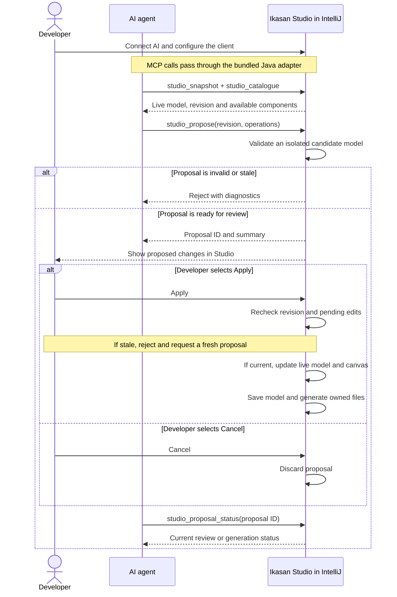

# AI proposals against the live Studio model

Studio can expose the open project's in-memory model to an MCP client. The client reads a
snapshot and the selected meta-pack's catalogue, then submits operations for review. It does
not edit `model.json` or apply changes itself.

## At a glance

The agent proposes changes to the live model; the developer reviews them in Studio before
anything is applied. Studio handles saving and generation after approval.



IntelliJ and the agent stay running throughout. The agent checks the proposal status to learn
whether review or generation is still pending, completed, or failed.

## Connect

1. Open your project and select **Tools → Connect AI to Ikasan Studio…** (also in Find Action).
2. On supported IDEs (2026.2 onward with the bundled MCP Server plugin), use the
   **IntelliJ MCP (recommended)** tab. Open MCP settings and check **Enable MCP Server**;
   this reveals the client configuration controls. For everyday use across projects, find
   your client under **Clients Auto-Configuration** (recommended). This reuses the client
   connection setup across projects. Choose **Project Clients Auto-Configuration** instead
   for setup specific to this project, or if your client is listed only there. Open the
   **Auto-Configure** dropdown and select **Configure with Streamable HTTP transport** if
   offered; otherwise, use the available Auto-Configure option. General client configuration
   does not enable Studio access automatically in every project: use **Connect AI to Ikasan
   Studio** in each project. A different IDE installation or changed server address may
   require reconfiguring the client.
   Click **Apply** or **OK**. In IntelliJ AI chat, click **+ New Chat** and select **Codex**.
   Paste the Studio test prompt into that new chat; this sequence was confirmed with the
   IntelliJ 2026.2.2 Codex integration. Other clients may need their own reconnect action.
   Specify the project when several projects are open.
3. Otherwise, use **Manual setup**, copy the configuration and merge its server entry into your
   AI client's MCP settings. The bundled Java adapter uses the IDE runtime; no Python, separate
   JDK or `JAVA_HOME` setup is needed for a client on the same machine.
4. Open and configure Studio, finishing any pending property edits and generation. Select
   **Copy test prompt** and paste it into your AI chat. The connection checklist shows whether Studio access is enabled, the model is ready,
   the selected route has tools available, and a client has successfully read the model or catalogue.
   Its next-step guidance changes after copying the prompt and after a successful read.
   Opening MCP settings alone does not verify the connection. A successful read records the
   last client check; it does not continuously monitor the client connection.
5. Ask for changes, then review the proposed operations in Studio and select **Apply** or **Cancel**.

Closing the connection dialog keeps access enabled. **Enable AI access automatically when this
project reopens** is selected by default when you first use Connect AI. You can clear it to disable automatic access. **Stop bridge** disables access and automatic reconnection. Closing
this project stops the bridge; reopening restores it when automatic access is enabled.
Without that option, use Connect AI again. Tools report an actionable error until Studio is ready.

Manual configuration paths are stable for this project and IDE configuration directory, so the
same client entry can be reused across bridge restarts. Session tokens rotate at every start.
Moving the project or changing the IDE installation/runtime may require copying the configuration
again. Two IDE sessions using the same configuration directory cannot own the same project's
connection simultaneously. The executable, adapter and connection paths belong to the IDE host;
containers, WSL and remote clients need a separately arranged connection.

The adapter uses [MCP stdio](https://modelcontextprotocol.io/specification/2025-03-26/basic/transports).
Its private HTTP connection is bound to `127.0.0.1`, requires a random bearer token, rejects
browser Origin headers, and is not a public Streamable HTTP MCP endpoint. Connection files live
in IntelliJ's configuration directory, outside the project; on POSIX systems the directory and token
file are owner-only. Do not share the connection file. No AI account, model provider or cloud
service is bundled. Known password, secret, token and credential fields are redacted from
snapshots; other model content is visible to the connected client, including text properties
that might themselves contain sensitive data.

## Tools

| Tool | Result |
| --- | --- |
| `studio_snapshot` | Live model, project name and opaque revision. No disk reload. |
| `studio_catalogue` | Component keys, property types/defaults/choices and payload contracts for the selected meta-pack. |
| `studio_propose` | Validates operations on an isolated model and opens a review. Returns a proposal ID and summary. |
| `studio_proposal_status` | `awaiting_review`, `cancelled`, `generating`, `applied`, `generation_failed`, or `undone`. |

Snapshots are bounded to the last eight reads and statuses to the last sixteen proposals.
Only one review can be pending per project. A proposal is checked again immediately before
Apply. Manual edits, model reloads, version migration and pending property edits prevent a
stale proposal from being applied. Obtain a fresh snapshot and propose again.

## Operation contract

Submit `{"revision":"<from studio_snapshot>","operations":[...]}` to `studio_propose`.
Operations execute in array order on a detached candidate. Up to 100 operations are accepted.

- `addFlow`: `type`, `flow` (new flow name).
- `addComponent`: `type`, `flow`, `key` (exact catalogue key), `name`, optional `properties` object.
  A consumer occupies the flow's consumer slot; other components are inserted before its terminal
  producer. Required properties with metadata defaults are materialised as in Studio.
- `setProperty`: `type`, `flow`, `component` (existing name), `property`, `value` (scalar or null).
- `connect`: `type`, `flow`, `order` (every component name exactly once, consumer first).
  This defines a linear flow order. Studio derives its persisted transitions.

For example, with an FTP-capable selected meta-pack:

```json
{
  "revision": "<revision returned by studio_snapshot>",
  "operations": [
    {"type": "addFlow", "flow": "Transfer"},
    {"type": "addComponent", "flow": "Transfer", "key": "FTP Consumer", "name": "ReadFiles",
     "properties": {"cronExpression": "0/5 * * * * ?", "sourceDirectory": "/incoming"}},
    {"type": "addComponent", "flow": "Transfer", "key": "FTP Producer", "name": "WriteFiles",
     "properties": {"outputDirectory": "/outgoing"}},
    {"type": "connect", "flow": "Transfer", "order": ["ReadFiles", "WriteFiles"]}
  ]
}
```

Read the catalogue for required host, port and credential settings; the example uses metadata
defaults where available. Submit complete valid flows. Unsupported components/properties, duplicate
names, missing required values, invalid property types/choices and known payload mismatches reject
the whole proposal. Payload checking uses Studio's design-time metadata and is not a substitute
for compiling and testing the generated application.

The initial API supports linear flows. Routers, edits to branched flows, exception resolvers,
deletion, renaming, implementation-class changes and version migration must use Studio's existing UI.
Unrelated flows and their object identities are preserved. No operation grants permission to
overwrite developer-owned code.

## Apply, generation and undo

Apply updates the live model, refreshes the canvas/properties, and uses Studio's normal protected
model persistence and generation pipeline. The model proposal has one global IntelliJ undo entry;
Undo and Redo regenerate the corresponding output. A failed immediate save rolls back the model.
An asynchronous generation failure is reported by Studio and as `generation_failed`: the model
remains applied so the developer can fix the problem and regenerate or undo it.

For external model edits, follow the project AGENTS.md guidance on overwrite protection and a
verified reload mechanism. Closing and reopening the editor tab alone does not guarantee a reload.
Keep IntelliJ and the agent running; use the live bridge for changes to an open Studio session.
