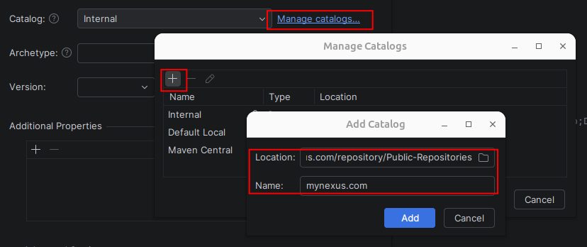

# Troubleshooting

Start with the Studio notification and the first relevant error in the Maven or Run/Debug output. a a  Later failures are often consequences of that first error. Preserve model files before attempting recovery.


| Symptom                                                | What to check                                                                                                                                                                                                                                                                                                                                                                                                                                                                                                                                                                    |
| ------------------------------------------------------ | -------------------------------------------------------------------------------------------------------------------------------------------------------------------------------------------------------------------------------------------------------------------------------------------------------------------------------------------------------------------------------------------------------------------------------------------------------------------------------------------------------------------------------------------------------------------------------- |
| Archetype absent                                       | This is common if you are in a corporate environment. First check to see if you can download the archetype manually using the**command below**. If you are going through a corporate repository like Nexus, while you are on the 'New Project screen', next to the catalogue field, click 'Manage catalogs', on tne nest screen click the plus icon, add in 'URL_to_my_nexus/repository/Public-Repositories' e.g. https://mynexus.com/repository/Public-Repositories (**see screen shot below for example**). Save and use that catalog and look for the ikasan-studio archetype |
| Maven dependencies unresolved                          | Check Maven repository access, offline mode, proxy, mirrors and credentials in your Maven settings. Refresh Maven after correcting them. The README includes a manual archetype alternative; use published coordinates appropriate to your candidate.                                                                                                                                                                                                                                                                                                                            |
| Studio waits for Maven/indexing                        | Allow initial import/indexing to finish. Inspect Maven import errors and the selected project SDK. Reopen via**Tools → Ikasan Studio → Open Ikasan Studio** if the editor was deliberately closed. Repeated cache invalidation is not the first recovery step.                                                                                                                                                                                                                                                                                                                 |
| Java release or class-version error                    | Align project SDK, Maven importer/runner and Run/Debug JRE with[Supported versions](SupportedVersions.md). IntelliJ's own runtime is separate.                                                                                                                                                                                                                                                                                                                                                                                                                                   |
| Address already in use                                 | Read the failing address in application/harness output. Check module HTTP, H2, JMS, SMTP, FTP and mail inbox ports. Stop the process that owns the port, or select another port and update both ends. Do not stop unrelated processes blindly.                                                                                                                                                                                                                                                                                                                                   |
| Mail inbox fails to open                               | Check the**Test Mail Server** Terminal and GitHub download access. The inbox uses shared local port 8025, even when SMTP ports differ. Another project can own it.                                                                                                                                                                                                                                                                                                                                                                                                               |
| FTP harness fails or SFTP cannot connect               | Check the details address, credentials and local port. The bundled server speaks plain FTP; use a separate SFTP server for SFTP transport.                                                                                                                                                                                                                                                                                                                                                                                                                                       |
| Process starts but Console/test actions fail           | Wait for the application startup message and check HTTP port/context path. A process can be alive while dependency initialization fails. Inspect the first exception in Run/Debug output.                                                                                                                                                                                                                                                                                                                                                                                        |
| Module starts but flow remains stopped                 | Inspect**flowStartupType** and Blue Console flow state/error details. Existing modules retain their configured startup type. Confirm required JMS/database/remote services are available.                                                                                                                                                                                                                                                                                                                                                                                        |
| Breakpoint never hits or Send Test Message unavailable | Use**Debug module**, wait for startup and ensure the consumer supports injection. Check that your breakpoint is in the code actually executed. Regenerate and restart after configuration or harness changes.                                                                                                                                                                                                                                                                                                                                                                    |
| Scan accepted but no file arrives                      | Check filename pattern, source directory, minimum file age and duplicate detection.**Check for files** is asynchronous. A synthetic **Send Test Message** does not verify scanning.                                                                                                                                                                                                                                                                                                                                                                                              |
| Generation fails after a converter choice              | Review source/target types and the saved recipe. Choose a compatible recipe or a custom implementation. An unknown/incompatible saved recipe blocks generation.                                                                                                                                                                                                                                                                                                                                                                                                                  |
| Model will not load or save                            | Follow[Project files and recovery](ProjectFilesAndRecovery.md). Preserve the original, inspect validated backups, permissions and disk space.                                                                                                                                                                                                                                                                                                                                                                                                                                    |

To check if you can download the archetype manually:

```shell
mvn dependency:get -U "-Dartifact=org.ikasan.studio:ikasan-studio-project-archetype:1.0.2"
```

Screen shot for changing catalog as described above



For custom component failures, inspect developer-owned implementations under `user/`; generated stubs still need business logic. After changing Maven dependencies or generated code, allow import/build to finish and restart the running module.

If the problem remains, use **Tools → Ikasan Studio → Collect Ikasan Studio Diagnostics…**. Review the local ZIP and include the candidate version, IDE build, selected pack, reproduction steps and expected/actual behaviour in your support report. Model or application-log attachments require separate review; they are not automatically included. See [diagnostics and privacy](DiagnosticsAndPrivacy.md).
